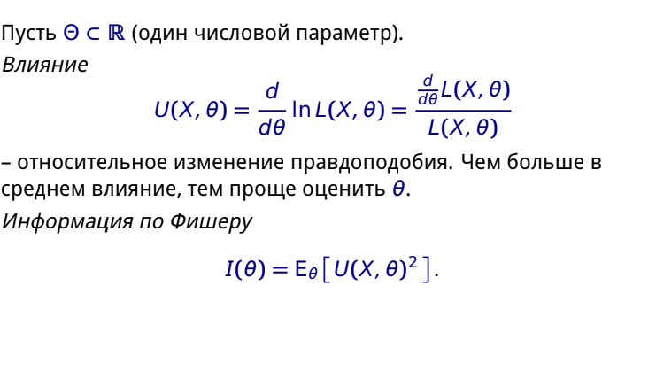
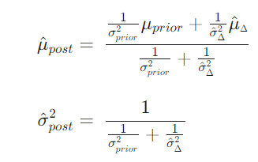
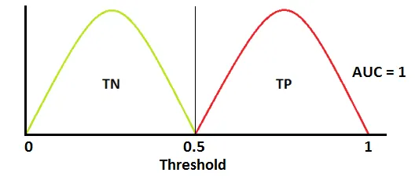
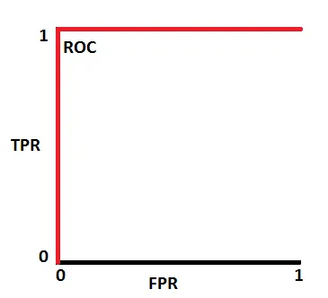
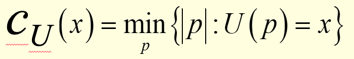

# Python

## 1\. Data structures

### defaultdict

```python
from collections import defaultdict
#Creating a defaultdict where the key is an int and the default value is 0
default_int_dict = defaultdict(int)
```

### hashable vs unmutable

!!! hashable -> unmutable, but not reverse

!!! necessery condition, but not sufficient

* In many programming environments, including Python, for an object to be hashable, it often needs to be immutable. This is because the hash value of the object should not change over time. If an object is mutable and its contents are changed, its hash value would change, leading to unpredictable behavior in hash-based data structures.

However, it's important to note:

* Not all immutable objects are necessarily hashable. For instance, while tuples are immutable, they are only hashable if all their elements are hashable.
* An object being immutable doesn't automatically mean it's suitable to be used as a dictionary key or in a set. It needs to be explicitly defined as hashable (e.g., by implementing the `__hash__` method in its class definition).

### typing

Python is a [**dynamically typed**](https://en.wikipedia.org/wiki/Type_system#DYNAMIC) programming language, which means the types are only checked at runtime and a variable is allowed to change its type over its lifetime, whereas a [**statically typed**](https://en.wikipedia.org/wiki/Type_system#Static_type_checking) language like Java checks the types at compile time, and a variable is not allowed to change its type over its lifetime. On the other hand, Python is a [**strongly typed**](https://en.wikipedia.org/wiki/Strong_and_weak_typing) language because the types cannot be automatically converted at runtime. For example, you cannot have an addition calculation on integer `1` and string `"2"`, while in a **weakly typed** language such as JavaScript such calculation is allowed.

### type annotation, type conversion (implicit and explicit)

Например  `def indent_right(s: str, width: int) -> str:.`

Например `price: int = 5`

* Implicit

Неявное преобразование типов автоматически выполняется интерпретатором Python.

Python позволяет избежать потери данных в неявном преобразовании типов.

```
integer_number = 123
float_number = 1.23
new_number = integer_number + float_number
```

* Explicit

Явное преобразование типов также называется приведением типов, типы данных объекта преобразуются с использованием предопределенной функции.

При приведении типов может произойти потеря данных, поскольку мы приводим объект к определенному типу данных.

int('3'), str(), float()

### 1.1 Strings

#### string interpolation

name = 'Chris'

print(f'Hello {name}')

print('Hey %s %s' % (name, name))

print( "My name is {}".format((name)) )

### 1.2 Lists

#### append

O(1), but every time, when list hits max capacity it doubles and n operations, but overall it is O(1)

left append is O(n) operations

#### copy and deepcopy()

copy - new object, all elements ref on copy

deepcopy - new object, and every element ref on copy, but when change, new element object, every element = new object

#### list and array

* array same data type
* it is written in c (continiuous?), is fast
* array +, - vector operations
* different methods append
* arrays less memory

## 1.5 Queue types in python

Queue data structure has three types: **FIFO, LIFO, and Priority Queue**

```
def heapsort(iterable):
    h = []
    for value in iterable:
        heappush(h, value)
    return [heappop(h) for i in range(len(h))]

heapsort([1, 3, 5, 7, 9, 2, 4, 6, 8, 0])
```

In fact, the `PriorityQueue` _implementation_ uses `heapq` under the hood to do all prioritisation work, with the base `Queue` class providing the locking to make this thread-safe. See the [source code](https://hg.python.org/cpython/file/v2.7.11/Lib/Queue.py#l212) for details.

### 1.6 Operators

#### difference & and AND

The difference is this: ``and`` and ``or`` gauge the truth or falsehood of *entire object*, while ``&`` and ``|`` refer to *bits within each object, !!**elementwise** comparision on !!**boolean values, use on !!!iterables***

When you use ``and`` or ``or``, it's equivalent to asking Python to treat the object as a single Boolean entity.

When you use ``&`` and ``|`` on **integers**, the expression operates on the bits of the element, applying the *and* or the *or* to the individual bits making up the number

#### difference == and is

Identity (is) and equality (==), can check by id(var), same or note memory cell

## 2.Design patterns

### Solid principles

https://telegra.ph/Principy-SOLID-v-inzhenerii-dannyh-CHast-1-09-07

### Patterns

- <font size="5" >  
  <b>Singleton </b> </font> -

 is a creational design pattern that ensures a class has only one instance and provides a global point of access to it. It restricts the instantiation of a class to a single object, allowing that object to be shared across the application.

1. Logging Module (`logging`): The standard Python logging module, `logging`, can be considered a singleton for logging purposes. You can configure it globally and access it from any part of the application.
2. Database Connections: Some database libraries like `SQLAlchemy` can handle connections in a singleton-like manner to ensure that only one database connection is used throughout the application.
3. Caching Libraries: Some caching libraries like `cachetools` may use singleton-like behavior to ensure there's only one cache instance used across the application.

Key characteristics of a singleton include:

1. Single Instance: A singleton class should have only one instance throughout the lifetime of the program.
2. Global Access: The singleton instance should be globally accessible so that other parts of the program can use it easily.

Singletons are often used in scenarios where having multiple instances of a class could cause issues or when there is a need to centralize control over a specific resource or functionality. Some common use cases for singletons include managing **database connections, file systems, logging services, configuration settings, or thread pools**.

```python
class Singleton:
    _instance = None

    @staticmethod
    def get_instance():
        if not Singleton._instance:
            Singleton._instance = Singleton()
        return Singleton._instance

```

!!! None in python - singlton python object and slow operations

!!! Nan - native float number for all systems IEEE standart

- <font size="5" >  
  <b>Decorator </b> </font> - 
  in python это функция, которая получает функцию в качестве входных данных и возвращает её в качестве выходных данных, но расширяя её функционал без изменения основной модели.

In software design patterns, a decorator is a structural design pattern that allows behavior to be added to an individual object dynamically, without affecting the behavior of other objects of the same class. It provides a way to extend or modify the functionality of an object at runtime by wrapping it with one or more decorator objects.

The decorator pattern follows the open-closed principle, which states that classes should be open for extension but closed for modification. Instead of directly modifying the original object or class, the decorator pattern allows additional functionality to be added by creating a decorator class that wraps the original object.

Key characteristics of the decorator pattern include:

1. Interface Inheritance: Both the original object and decorator implement the same interface, allowing the decorator to be used in place of the original object.
2. Composition: The decorator contains a reference to the wrapped object and can modify its behavior by delegating to the wrapped object and adding its own functionality.
3. Recursive Composition: Decorators can be stacked or combined together, allowing multiple layers of behavior to be added to an object.

The decorator pattern provides a flexible and modular way to add or alter the behavior of objects without **changing their underlying structure.**

- <font size="5">  
  <b>Factory method </b></font>

The Factory Method pattern is a creational design pattern that provides an interface for creating objects, but allows subclasses to decide which class to instantiate. It promotes loose coupling by abstracting the object creation process.

In the Factory Method pattern, there is a base class or interface that declares the factory method, which is responsible for creating objects. Subclasses of this base class can override the factory method to create different variations or types of objects, while still adhering to the same interface.

```python
from abc import ABC, abstractmethod

class Product(ABC):
    @abstractmethod
    def operation(self):
        pass

class ConcreteProductA(Product):
    def operation(self):
        return "ConcreteProductA operation"

class ConcreteProductB(Product):
    def operation(self):
        return "ConcreteProductB operation"

class Creator(ABC):
    @abstractmethod
    def factory_method(self):
        pass

    def operation(self):
        product = self.factory_method()
        return product.operation()

class ConcreteCreatorA(Creator):
    def factory_method(self):
        return ConcreteProductA()

class ConcreteCreatorB(Creator):
    def factory_method(self):
        return ConcreteProductB()

# Usage
creator_a = ConcreteCreatorA()
product_a = creator_a.operation()
print(product_a)  # Output: ConcreteProductA operation

creator_b = ConcreteCreatorB()
product_b = creator_b.operation()
print(product_b)  # Output: ConcreteProductB operation


```

we have a base `Product` class with two concrete implementations: `ConcreteProductA` and `ConcreteProductB`. We also have a base `Creator` class with two concrete implementations: `ConcreteCreatorA` and `ConcreteCreatorB`. Each concrete creator subclass overrides the `factory_method` to create a specific type of product. The `Creator` class's `operation` method uses the `factory_method` to create the product and performs some operation on it.

The Factory Method pattern allows the client code to work with the abstract `Creator` class, without knowing the specific product being created. The actual product creation is delegated to the concrete creator subclasses.

Note that the Factory Method pattern is just one of many design patterns and is useful when there is a need for flexible object creation or decoupling the client code from the specific object types.

- <font size="5">  
  <b>Delegation </b></font>

In software design patterns, delegation is a structural design pattern that allows an object to delegate a specific task or responsibility to another object. The delegation pattern promotes code reuse and modular design by enabling objects to collaborate and share functionality without direct coupling or inheritance.

In delegation, an object delegates a specific task to another object, known as the delegate or delegate object. The delegate object is responsible for performing the delegated task, while the delegating object retains control and can coordinate the overall behavior.

Key characteristics of the delegation pattern include:

Collaboration: The delegating object collaborates with the delegate object to achieve a specific functionality or task.

Separation of Concerns: Delegation separates the concerns of the delegating object and the delegate object, allowing them to focus on their respective responsibilities.

Dynamic Behavior: Delegation allows the delegate object to be changed or swapped at runtime, providing flexibility in behavior.

Delegation is often used when a class or object needs to use functionality that is already implemented in another class or object, without inheriting from it. It helps achieve code reuse, modularity, and loose coupling between objects.

A common example of delegation is the use of composition over inheritance. Instead of inheriting behavior from a superclass, an object can delegate specific tasks to another object that specializes in that behavior.

```python

class Delegate:
    def do_task(self):
        print("Delegate: Performing task")

class Delegator:
    def __init__(self):
        self.delegate = Delegate()

    def do_task(self):
        print("Delegator: Delegating task to delegate")
        self.delegate.do_task()

# Usage
delegator = Delegator()
delegator.do_task()


```

- <font size="5">  
  <b>dependency injection </b></font>

The Dependency Injection pattern is a design pattern used in object-oriented programming that focuses on managing dependencies between objects. It helps to decouple classes and promotes loose coupling by shifting the responsibility of creating and providing dependent objects to external entities.

In the Dependency Injection pattern, rather than having a class directly create or look up its dependencies, the dependencies are injected into the class from outside. This allows for more flexibility, testability, and easier maintenance of the code.

There are three common forms of Dependency Injection:

Constructor Injection: Dependencies are provided to a class through its constructor. The dependencies are passed as parameters during the instantiation of the class.

Setter Injection: Dependencies are provided to a class through setter methods. The class exposes setter methods that can be used to set the dependencies after the object has been created.

Interface Injection: The class implements an interface that defines methods for injecting dependencies. The dependencies are injected through these interface methods.

The Dependency Injection pattern helps to achieve inversion of control, where the responsibility for managing dependencies is delegated to an external entity or framework. This allows for more modular and flexible code, as objects are not tightly coupled to their dependencies, and different implementations can be easily swapped.

```python
class ServiceA:
    def do_something(self):
        print("Service A is doing something.")

class ServiceB:
    def __init__(self, service_a):
        self.service_a = service_a

    def do_something_else(self):
        print("Service B is doing something else.")
        self.service_a.do_something()

# Usage
service_a = ServiceA()
service_b = ServiceB(service_a)
service_b.do_something_else()


```

- <font size="5">  
  <b>inversion of control </b></font>

The Inversion of Control (IoC) pattern, also known as the Hollywood Principle ("Don't call us, we'll call you"), is a design principle that governs the flow of control and dependency management in software systems. It is not a specific design pattern, but rather a general concept that influences the design and structure of an application.

In traditional programming, the flow of control is typically determined by the application code. For example, a class instantiates and controls the lifecycle of its dependencies, and methods within the class call other methods as needed.

In contrast, the Inversion of Control pattern flips the traditional flow of control. Instead of the application code directly controlling the dependencies, control is inverted or shifted to an external entity or framework. This external entity takes responsibility for managing the dependencies and orchestrating the application's execution.

Inversion of Control is often achieved through the use of a dependency injection framework or container. The framework takes care of creating and managing the instances of objects, as well as injecting dependencies into the appropriate objects. The application code then focuses on defining the desired behavior and relies on the framework to handle the instantiation and wiring of dependencies.

### Patterns structure in OOP

***Creational Patterns:***

Factory Method: Creates objects without specifying the exact class of the object to be created.
Abstract Factory: Provides an interface for creating families of related or dependent objects without specifying their concrete classes.
Singleton: Ensures a class has only one instance and provides a global point of access to it.
Builder: Separates the construction of complex objects from their representation, allowing the same construction process to create different representations.
***Structural Patterns:***

Adapter: Converts the interface of a class into another interface clients expect, enabling classes to work together that otherwise couldn't.
Decorator: Dynamically adds responsibilities to objects by wrapping them with one or more decorator objects.
Composite: Composes objects into a tree structure to represent part-whole hierarchies. Clients can treat individual objects and compositions uniformly.
Proxy: Provides a surrogate or placeholder for another object to control access to it.
***Behavioral Patterns:***

Observer: Defines a one-to-many dependency between objects, so that when one object changes state, all its dependents are notified and updated automatically.
Strategy: Defines a family of interchangeable algorithms and encapsulates each one, allowing them to be used interchangeably based on the context.
Template Method: Defines the skeleton of an algorithm in a base class, allowing subclasses to redefine certain steps of the algorithm without changing its structure.
Command: Encapsulates a request as an object, allowing parameterization of clients with different requests, queuing, or logging of requests, and support for undoable operations.

### lambda function

profiler (cprofiler) don't see lambda functions and can not check it performance

### with context manager

has two magic methods (underscore method in class)

--enter()

--close()

### Data classes

```

from typing importAny, Optional
from operator import attrgetterclassFieldAttributes:

class FieldAttributes:
"""
  Field attributes.
  We will want to access these dynamically
  """
  example: Any
  default: Any
  description: Optional[str]def__init__(self, example=None, default=None, description=None):
    self.example = example
    self.default = default
    self.description = descriptionclassField(FieldAttributes):

class Field(FieldAttributes):
"""Class representing a field"""
  name: str
  attrs: FieldAttributesdef__init__(self, name, **kwargs):
    self.name = name
    self.attrs = FieldAttributes(**kwargs)

class UserData:
"""Class representing our user data"""    name = Field("user_name", example="Willy Wonka")
    country = Field("country", default="USA", example="Wonka-land")
    n_wonka_bars = Field("n_wonka_bars", default=0, example=11)
    has_golden_ticket = Field("has_golden_ticket", default=False)
    is_an_oompa_loompa = Field("is_an_oompa_loompa",
      description="Is this person an Oompa Loompa?"
    )
    fields = (
        name,
        country,
        n_wonka_bars,
        has_golden_ticket,
        is_an_oompa_loompa
    )
```

### Declarative and imperative coding

* **Imperative code (non-declarative)** tells your compiler what a program does, step by step. The compiler cannot skip steps, because each step is completely dependent on the previous step.
* **Declarative code** tells your compiler what a program’s desired state should be, abstracting the steps how to achieve it. The compiler can skip steps or combine them, since it can determine ahead of time all of the states.

`list[0]` is [non-declarative](https://medium.com/educative/declarative-vs-imperative-programming-5-key-differences-36b75e4d69e5) >> meaning, your program has no guarantee what the attribute will be, until it gets it

```
from operator import is_not
from functools import partial

def  get_first_non_null_generator(my_vals: list, default=None):
    """
        Get first non-null value using
        a generator (via filter).
  
    """

    '''create generator values'''

    filtered_vals = filter(partial(is_not, None), my_vals)
    return next(filtered_vals, default)
```

Imperative - because we know state of returned value (is not None)

```
my_doc = {
"field_1": "one",
"field_2": "two"
}
res =
 get_first_non_null_generator(
map(my_doc.get, ("field_1", "field_2"))
)
```

### Decorators

Function of function and return function (logger, get time of execution)

Декоратор – это функция, которая получает функцию в качестве входных данных и возвращает её в качестве выходных данных, но расширяя её функционал без изменения основной модели.

У декоратора есть одна приятная особенность: вы можете написать код для одной функции, а далее использовать его по-необходимости с другими.

Типичный случай использования декораторов – это логирование.

def logging(func):

def log\_function\_called():

print(f'{func} called.')

func()

return log\_function\_called

### DVC - data version controlThere 3 main entities:

* > output (real files of projects) - data folder in example
  >
* cache (hashes of files, flat structure for tracking data changes)
* remote (local external) storage (need access) - remote cache or(and) output

> CREATE dvc in repo
>
> +1. dvc with local storage of cache and outputs (example im\_sales) you need do dvc folder "data
>
> 1.1 dvc init git status
>
> Changes to be committed: new file: .dvc/.gitignore new file: .dvc/config ... git commit -m "Initialize DVC"
>
> 1.2 dvc remote add {name} 'path/to/remote/**cache** storage (for cache) - can be local path ('C:\_Work\\datasets or )
>
> 1.3 dvc add data (adds outputs to local cache (.dvc/cache)) -> data.dvc git add data/data.xml.dvc (add .) git commit -m "Add raw data" git push
>
> 1.4 dvc push - push to remote storage **cache** Make changes dvc add data & git commit & git push Switch between versions git checkout & dvc checkout
>
> **dvc pull** 2. remote cache
>
> 1.1 dvc init git status Changes to be committed: new file: .dvc/.gitignore new file: .dvc/config ... git commit -m "Initialize DVC"
>
> 1.2 dvc remote add {name} 'path/to/remote/**cache** storage (for cache) - can be local path ('C:\_Work\\datasets or )
>
> 1.3 dvc config cache.s3 {name}
>
> 1.4 dvc add **data** (local data) -> data.dvc then git commit & git push dvc add --external path/to/**data** (external data) -> data.dvc, then git commit&git push

USAGE and REPRODUCTION of repo for others (im\_sales)

!All data and cache are added to .gitignore and are saved only **locally**. To use repo (im\_sales) and get access to data create remote folder (\_WORK) to wich others collaborators **have access (keys or tokens or local shared net)**.

When git clone repo, then dvc pull to get data from my shared folder \_WORK. (all info for pull is in data.dvc file)

## 3.OOP

### init, new

https://medium.com/towards-data-science/python-init-is-not-a-constructor-a-deep-dive-in-python-object-creation-9134d971e334

`__new__` is a static method that is responsible for creating a new instance of a class. It is called before `__init__` and is used to create and return the new object.

`__init__` is an instance method that is called after the new and is used when we call created class

```python
classSimpleObject:
  greet_name:str
	class SimpleObject:
  greet_name:str

  def __new__(cls, *args, **kwargs):      # <-- newly added function
    print("__new__ method")     
    return super().__new__(cls)  

  def __init__(self, name:str):
    print("__init__ method")
    self.greet_name = name

  def say_hello(self) -> None:
    print(f"Hello {self.greet_name}!")

my_instance = SimpleObject(name="bob")
my_instance.say_hello()
```

Notice that __new__ is being called on the super() method, which returns a “reference” (it’s actually a proxy-object) to the **parent-class of SimpleObject**. Remember that SimpleClass inherits from object, where the __new__method is defined.

Breaking it down:

1. we get a “reference” to the base class of the class we’re in. In the case of SimpleObject we get a “reference” to object
2. We call __new__ on the “reference” so object.__new
3. __We pass in cls as an argument.
   This is how class methods like __new__ work; it’s a reference to the class itself
   **cls** - reference to class, self - reference to curent instance

### magic methods

double undescore(dunder)  **predefined** methods give special functionality to classes

--str--, --repr--, --len--, --init--, --new--, --next--, --iter--, --getitem--

### introspection in python

Интроспекция — это способность программы исследовать тип или свойства объекта во время работы программы

/ Java

if(obj instanceof Person){ Person p = (Person)obj; p.walk(); }

В Python самой распространённой формой интроспекции является использование метода dir для вывода списка атрибутов объекта

isinstance(foo, object))

### reflection

Интроспекция позволяет вам изучать атрибуты объекта во время выполнения программы, а **рефлексия** — манипулировать ими.

**Рефлексия** — это способность компьютерной программы изучать и модифицировать свою структуру и поведение (значения, мета-данные, свойства и функции) во время выполнения.

Простым языком: она позволяет вам _вызывать методы объектов, создавать новые объекты, модифицировать их, даже не зная имён интерфейсов, полей, методов во время компиляции._

Из-за такой природы **рефлексии** её труднее реализовать в статически типизированных языках, поскольку ошибки типизации возникают во время компиляции, а не исполнения программы (подробнее об этом здесь). Тем не менее, она возможна, ведь такие языки, как Java, C# и другие допускают использование как интроспекции, так и **рефлексии** (но не C++, он позволяет использовать лишь интроспекцию).

По той же причине **рефлексию** проще реализовать в интерпретируемых языках, поскольку когда функции, объекты и другие структуры данных создаются и вызываются во время работы программы, используется какая-то система распределения памяти. Интерпретируемые языки обычно предоставляют такую систему по умолчанию, а для компилируемых понадобится дополнительный компилятор и интерпретатор, который следит за **корректностью рефлексии.**

**Пример:**

\`# Без рефлексии Foo().hello()

с рефлексией

getattr(globals()'Foo' (about:blank), 'hello')

### descriptor

**Дескриптор** - такой атрибут объекта, поведение которого переопределяется специальными методами. Проще говоря, доступ к какому-то свойству экземпляра можно переопределить с учетом дополнительных проверок. Если делать эти верификации без дескрипторов, то один и тот же код начнет повторяться.

Существует 4 метода протокола дескрипторов: `get__()` - получить значение свойства; `set__()` - задать значение; `delete__()` - удалить атрибут; `set_name__()` - присвоить имя свойству (появился в Питоне версии 3.6).

Если применяется только метод  `__get__(),` то мы имеем дело с дескриптором без данных, а если есть еще и `__set__()`, то речь будет идти о дескрипторе данных.

Покажем использование дескрипторов на вышеупомянутом примере.

**Example**

Создаем класс с протоколами дескриптора

`class StringChecker:`

```
class StringChecker:

    # # Получаем доступ к свойству
    def __get__(self, instance, owner):
        if instance is None:
            return self
        return instance.__dict__[self.name]

    # Меняем свойство
    def __set__(self, instance, str_value):
        if not isinstance(str_value, str):
            raise ValueError('Нужно предоставить строку')
        elif len(str_value) < 2:
            raise ValueError('Необходимо минимум 2 буквы')
        instance.__dict__[self.name] = str_value

    # Задаем имя свойства
    def __set_name__(self, owner, name):
        self.name = name
```

```
class Employee:

    # Определяем атрибуты (их может быть любое количество)
    name = StringChecker()

    # Инициализируем свойства с учетом требуемых проверок
    def __init__(self, name):
        self.name=name
```

Тесты

`director = Employee('Иван', 'Николаевич', 'Прогин', 'Директор') print(director.__dict__) director.name = 1 director.name = 'A'`

### exemple (self, ), class(cls, ) and static () methods

**Методы экземпляра** : принимают параметр self и относятся к определенному экземпляру класса. self in call

**Статические методы** : используют декоратор @staticmethod, не связаны с конкретным экземпляром и являются автономными (атрибуты класса или экземпляра не изменяются). - dont change class or example

**Методы класса** : принимают параметр cls, можно изменить сам класс. call (cls, )

### func and func()

func - object, you can use it as attribute, as var, func() - call of func

### Is function in python a instance of class?

In Python, the built-in type `function` represents functions. It is the type to which functions belong. When you define a function in Python, it becomes an instance of the `function` type.

Type is represented as class.

In Python, the `function` type is implemented as a class, which means that functions are instances of the `function` class. This class is one of the built-in classes provided by Python. Therefore, functions in Python can be considered as objects of the `function` class.

To clarify, the `function` type is both a class and the type of functions in Python. It is a special built-in class specifically designed to handle function objects.

### Как изменить способ вывода объектов?

Используйте методы **str** и \__repr_ _str_ - readable **repr** - unumbigous str(3) == str("3")

For a `datetime` object like `datetime.datetime(2023, 10, 8, 12, 34, 56)`, the representations would be:

* Using `repr()`: 'datetime.datetime(2023, 10, 8, 12, 34, 56)'
* Using `str()`: '2023-10-08 12:34:56'

As you can see:

* The `repr()` version provides a detailed representation that could be used to **recreate** the object.
* The `str()` version provides a human-readable format.

### перегрузка операторов

> под операторами в данном контексте понимаются не только знаки +, -, \*, /, обеспечивающие операции сложения, вычитания и др., но также специфика синтаксиса языка, обеспечивающая операции создания объекта, вызова объекта как функции, обращение к элементу объекта по индексу, вывод объекта
>
> **call**, **getitem**

### ORM

object-relational mapping - To connect database with model data

SQLAlchemy in Flask, ORM in Django

### Coupling

In object-oriented programming (OOP), coupling refers to the degree of interdependence or connectivity between classes or components within a system. It indicates how closely two or more classes are connected or reliant on each other.

Coupling is an important concept in OOP as it affects the maintainability, flexibility, and reusability of code. There are different levels of coupling, ranging from loose coupling to tight coupling:

1. Loose Coupling: Loose coupling implies that classes or components have minimal knowledge or dependency on each other. They interact through well-defined interfaces or abstractions, allowing them to be modified, extended, or replaced independently without affecting other components. Loose coupling promotes modularity, flexibility, and code reusability.
2. Tight Coupling: Tight coupling occurs when classes or components have strong dependencies and rely heavily on each other's implementation details. Changes made to one class may require modifications in other classes, resulting in a high degree of interdependence. Tight coupling can make code more difficult to maintain, test, and reuse.

Reducing coupling and promoting loose coupling is generally considered a good practice in software development. It helps achieve modular, decoupled, and maintainable code. This is often done through techniques such as encapsulation, abstraction, dependency injection, and the use of design patterns like Dependency Injection and Inversion of Control (IoC).

By reducing coupling and promoting loose coupling, you can create more flexible and maintainable software that is easier to modify, extend, and adapt to changing requirements.

## 4.Modules

### Installation

pip install pip-tools

pip-compile (uses requiriments.in)

The `pip-compile` command lets you compile a `requirements.txt` file from your dependencies, specified in either `pyproject.toml`, `setup.cfg`, `setup.py`, or `requirements.in`

requiriments.in example:

librosa

matplotlib

mwparserfromhell

svglib

tensorflow==1.14

### Модуль, пакет, библиотека

– это просто файл Python, который предназначен для импорта в скрипты или в другие модули. Он содержит функции, классы и глобальные переменные.

Пакет – это набор модулей, которые сгруппированы вместе внутри папки для обеспечения согласованной функциональности. Пакеты могут быть импортированы точно так же, как модули. Обычно в них есть **init**.pyfile, который указывает интерпретатору Python обрабатывать их.

Библиотека – это набор пакетов.

package is catalog with modules, all packages are moduls, library is catalog with packages

### Как бы вы использовали \* args и \*\*kwargs?

\*args и \*\*kwargs – это конструкции, которые делают функции Python более гибкими, принимая изменчивое количество аргументов.

* \*args передаёт изменчивое количество аргументов без ключевых слов в список
* \*\*kwargs передаёт изменчивое количество аргументов с ключевыми словами в словарь

## 5\. Exceptions

### example

try: # попробовать сделать это except: # если блок try не сработал, попробовать это finally: # всегда делать это

## 6\. Multiprocessing and multithreading

### В чём заключается проблема с многопоточностью в python?

Глобальная блокировка интерпретатора (или GIL) не позволяет интерпретатору Python выполнять более одного потока одновременно. Проще говоря, GIL требует, чтобы в Python всегда выполнялся только один поток.

### В чём разница между многопроцессорностью и многопоточностью?

Многопроцессорность и многопоточность – это парадигмы программирования, направленные на ускорение вашего кода.

**Многопроцессорность** – это вариант реализации вычислений, когда для решения некоторой прикладной задачи используется несколько независимых процессоров. Процессоры независимы и не взаимодействуют друг с другом: они не используют одну и ту же область памяти и имеют строгую изоляцию между собой. Что касается приложений, то многопроцессорная обработка подходит для рабочих нагрузок с интенсивным использованием ЦП. Однако он имеет большой объем памяти, который пропорционален количеству процессоров.

**Multiprocessing is the only truly parallel approach in Python** . Multiprocessing is generally used for **CPU intensive tasks** such as large matrix multiplications, parallel sorting a billion integers etc

С другой стороны, в **многопоточных** приложениях потоки находятся внутри одного процессора. Следовательно, они используют одну и ту же область памяти: они могут изменять одни и те же переменные и могут мешать друг другу. В то время как процессы строго выполняются параллельно, в Python в данный момент времени выполняется только один поток, и это связано с глобальной блокировкой интерпретатора (GIL). Многопоточность подходит для приложений, связанных с вводом-выводом, таких как очистка веб-страниц или извлечение данных из базы данных.

Если вы хотите узнать больше о многопоточности и многопроцессорности, я рекомендую вам ознакомиться с [этой статьей](https://medium.com/contentsquare-engineering-blog/multithreading-vs-multiprocessing-in-python-ece023ad55a).

In  **multithreading** , we use a **single process** only but we can create multiple threads running in single process. In Python, due to the  **Global Interpreter Lock** , although we can create multiple threads in a process, **but at any given point in time, only a single thread is running** (i.e. can access the variable and function stack of the process).

But since there is overhead in  **creating and destroying threads** , creating more threads beyond certain number do not improve the performance and they start degrading beyond that

In asyncio, we have only a  **single process and a single thread** .

There is an **event scheduler** known as the “ **Event Loop** ”. Think of the event loop as a  **circular queue** .

> When the thread T is waiting for the URL 1 to be downloaded, the event scheduler assigns URL 2 to thread T and while URL 1 is being downloaded, T can start initiating request for URL 2 and then the event loop will assign the next URL to T.

In other words asyncio facilitates asynchronous programming i.e. fire and forget

In asyncio, a task can only start when the previous task in the queue ‘pauses’ but in multithreading, a task can start if there is any idle thread.

Takeaways

1. Use asyncio only when the  **number of tasks to complete are high** .
2. Use asyncio only when the **tasks are time consuming** i.e. the time taken to complete a task is much higher than the time taken for the event loop to pickup and assign the next task to the thread.
3. There could be scenarios where multithreading or normal synchronous operations wins over asyncio. **Evaluate **before finalizing the codes.
4. **Avoid local file I/O** with asyncio.

[https://medium.com/@mecha-mind/think-twice-before-using-asyncio-in-python-7683472cb7a3](asyncio_vs_multithreading)

### Multithreading code

```
import time
from concurrent.futures import ProcessPoolExecutor, ThreadPoolExecutor

import matplotlib.pyplot as plt
import numpy as np


def multithreading(func, args, workers):
    with ThreadPoolExecutor(workers) as ex:
        res = ex.map(func, args)
    return list(res)


def multiprocessing(func, args, workers):
    with ProcessPoolExecutor(workers) as ex:
        res = ex.map(func, args)
    return list(res)


def cpu_heavy(x):
    print('I am', x)
    start = time.time()
    count = 0
    for i in range(10**8):
        count += i
    stop = time.time()
    return start, stop


def visualize_runtimes(results, title):
    start, stop = np.array(results).T
    plt.barh(range(len(start)), stop - start)
    plt.grid(axis='x')
    plt.ylabel("Tasks")
    plt.xlabel("Seconds")
    plt.xlim(0, 22.5)
    ytks = range(len(results))
    plt.yticks(ytks, ['job {}'.format(exp) for exp in ytks])
    plt.title(title)
    return stop[-1] - start[0]


plt.subplot(1, 2, 1)
visualize_runtimes(multithreading(cpu_heavy, range(4), 4), "Multithreading")
plt.subplot(1, 2, 2)
visualize_runtimes(multiprocessing(cpu_heavy, range(4), 4), "Multiprocessing")
plt.show()
```

**multithreading**

```
wiki_page_urls = ["https://en.wikipedia.org/wiki/" + str(i) for i in range(50)]
with concurrent.futures.ThreadPoolExecutor() as executor:
    futures = []
    for url in wiki_page_urls:
        futures.append(executor.submit(get_wiki_page_existence, wiki_page_url=url))
        # # many parameters
        # futures.append(executor.submit(lambda p: get_columns_batch(*p),
        #                         [docs_left_all, docs_right_all, docs_pages_all, batch, model, ith]))
    for future in concurrent.futures.as_completed(futures):
        print(future.result())
```

### asyncio code (python 3.9)

We say that an object is an **awaitable** object if it can be used in an [code class=&#34;code-span&#34;`<span class="pre">`await](https://docs.python.org/3.9/reference/expressions.html#await) expression. Many asyncio APIs are designed to accept awaitables.

There are three main types of _awaitable_ objects: **coroutines** , **Tasks** , and **Futures** .

Important

In this documentation the term “coroutine” can be used for two closely related concepts:

* a _coroutine function_ : an **async def** function;
* a _coroutine object_ : an object returned by calling a _coroutine function_ .

Tasks are used to schedule coroutines concurrently. A Future is a special low-level awaitable object that represents an eventual result of an asynchronous operation

```
import asyncio
import concurrent.futures

def blocking_io():
    # File operations (such as logging) can block the
    # event loop: run them in a thread pool.
    with open('/dev/urandom', 'rb') as f:
        return f.read(100)

def cpu_bound():
    # CPU-bound operations will block the event loop:
    # in general it is preferable to run them in a
    # process pool.
    return sum(i * i for i in range(10 ** 7))

async def main():
    loop = asyncio.get_running_loop()

    ## Options:

    # 1. Run in the default loop's executor:
    result = await loop.run_in_executor(
        None, blocking_io)
    print('default thread pool', result)

    # 2. Run in a custom thread pool:
    with concurrent.futures.ThreadPoolExecutor() as pool:
        result = await loop.run_in_executor(
            pool, blocking_io)
        print('custom thread pool', result)

    # 3. Run in a custom process pool:
    with concurrent.futures.ProcessPoolExecutor() as pool:
        result = await loop.run_in_executor(
            pool, cpu_bound)
        print('custom process pool', result)

asyncio.run(main())
```

\*\*Сопрограмма (coroutine) \*\* — результат вызова асинхронной функции, представляющий собой выполнение этой функции, способное приостанавливаться. Так как в общем случае невозможно определить сколько раз и на какое время выполнение будет приостановлено, невозможно и сказать когда оно будет закончено. Ваш код может либо ждать завершения выполнения сопрограммы с помощью оператора await, либо поручить ожидание циклу событий и продолжить свой выполнение.

**В первом случае**

```
async def callee():
    print('Hello')

async def caller():
    await callee()
    print('World')
```

выполнение caller приостановится до выполнения callee. В этот момент какие-то другие операции в каких-то других сопрограммах могут продолжаться, но `caller` будет ждать там, где выполнил `await`.

Во втором случае

```
async def callee():
    print('Hello')

async def caller():
    asyncio.create_task(callee())
    print('World')
```

**caller** сразу же продолжит свою работу. Строка `"World"` будет выведена раньше, чем "`Hello".` Здесь мы видим, что caller поставил циклу событий задачу выполнить сопрограмму callee.

Но что если, callee будет возвращать какое-то значение, которое нужно вызывающей стороне, но не прямо сейчас, а когда будет готово? Вот тут-то на сцену выходят футуры.

\*\*Футура (Future) \*\* - будущий результат выполнения сопрограммы. Метод `ensure_future` поручает циклу событий выполнить сопрограмму и сразу же, в момент вызова, возвращает футуру, в которой будет значение, но неизвестно когда. Вызывающая сторона может подождать выполнения футуры так же, как ожидало саму сопрограмму

**wait future**

```
async def callee(fut, word):
    fut.set_result(word)

async def caller():
    loop = asyncio.get_running_loop()
    # Create a new Future object.
    fut = loop.create_future()
    # Run "set_after()" coroutine in a parallel Task.
    # We are using the low-level "loop.create_task()" API here because
    # we already have a reference to the event loop at hand.
    # Otherwise we could have just used "asyncio.create_task()".
    loop.create_task(callee(fut, '... world'))
    # Wait until *fut* has a result (1 second) and print it.
    print(await fut + ' Hello')

await caller() # for jupyter notebook, becouse loop is already running in jupyter
# asyncio.run(main()) # for py file
```

**do something while future is not done**

```
async def callee(fut, word):
    await asyncio.sleep(4)
    fut.set_result(word)

async def caller():
    loop = asyncio.get_running_loop()
    # Create a new Future object.
    fut = loop.create_future()
    loop.create_task(callee(fut, '... world'))
    while not fut.done():
        await asyncio.sleep(1)
        print('do something when fut is running')

    print(await fut + ' World')

await caller() # for jupyter notebook, becouse loop is already running in jupyter
```

**callback**

```
import functools
async def callee(fut, word):
    await asyncio.sleep(4)
    fut.set_result(word)

async def caller():
    loop = asyncio.get_running_loop()
    # Create a new Future object.
    fut = loop.create_future()
    loop.create_task(callee(fut, '... world'))
    fut.add_done_callback(functools.partial(print, "Future:"))
    print('test')
```

**asyncio concurrent**

```
async def main():
    await function_that_returns_a_future_object() # task

    # this is also valid:
    await asyncio.gather(
        function_that_returns_a_future_object(),
        some_python_coroutine()
    )

all_the_coros = asyncio.gather(
*[self._worker(i) for i in range(self.max_workers)])
async def _worker(self, i):
    return
```

## 7\. Input output

### Как прочитать файл объемом 8 ГБ на Python с помощью компьютера с 2 ГБ ОЗУ

with open("./large\_dataset.txt") as input\_file: for line in input\_file: process\_line(line)

## Help, documentation

?, ??

str.**with**? - search for method
help(L.insert)

# Statistic and probability

## congugate prior

https://en.wikipedia.org/wiki/Conjugate_prior

!!hyperparameters of cogugate prior - pseudo-observations of successess and failures, when we add new data

## method jack-nife for analys of confidence intervals (mapie library)

sampling without replacement

В каждом случае регрессии jackknife модель подгоняется ко всем точкам данных, исключая пару (Xi, Yi). Это позволяет вычислить остатки метода leave-one-out. Интерпретируя такие остатки как несоответствия, мы можем оценить квантиль и определить интервалы прогнозирования, как в случае индуктивного конформного прогнозирования. Поскольку данный метод борется с избыточной подгонкой, используя для вычислений остатки вне выборки, теоретически ожидается, что он обеспечит адекватный охват.

Отличием методов jackknife и jackknife+ с точки зрения построения интервалов прогнозирования является использование в последнем методе в тестовой точке leave-one-out-прогнозов. Это делается для учета изменчивости подогнанной функции регрессии, дополняя квантили leave-one-out-остатков, используемых в методе jackknife. Такое усовершенствование позволяет методу jackknife+ обеспечивать надежные гарантии охвата независимо от распределения точек данных и для любого алгоритма, симметрично обрабатывающего точки обучения.

Однако метод jackknife+ отличается тем, что для учета изменчивости подогнанной функции регрессии в тестовой точке используются leave-one-out-прогнозы, а также квантили leave-one-out-остатков, как при кросс-конформном прогнозировании.

## Mutual information, entropy

Mutual information shows how change in one variable is related to change in target (like r^2 for descrite variables, if var is continious you can make bins). It is related to entropy ( sum of prob and log of prob multiplication )
\,

where is the [joint probability *mass* function](https://en.wikipedia.org/wiki/Joint_distribution "Joint distribution") of and ,  and and are the [marginal probability](https://en.wikipedia.org/wiki/Marginal_probability "Marginal probability") mass functions of and respectively

Entropy - "uncertainty" inherent to the variable's possible outcomes, level of randomness

!!! In ML - it is log loss (cross entropy loss function)

Entropy - expected value of surprise   ($\dfrac{1}{p(x_i)}$)

**$E =\sum_{i=0}^{n} p(x_i) \ln (\dfrac{1}{p(x_i)})$**

## Principle of maximum entropy

The principle of maximum entropy states that the probability distribution which best represents the current state of knowledge is the one with largest entropy, in the context of precisely stated prior data (such as a proposition that expresses testable information). These prior data serves as the constrains to the probability distribution.

Given the second law of thermodynamics (principle of increase of entropy), isolated systems spontaneously evolve towards thermodynamic equilibrium, the state with maximum entropy, maximum entropy distributions become the most natural distributions under certain constrains

## Central limit theorem

Convergence by probability - to constant

convergence by distribution - to anothery distribution

Whatever the form of the population distribution, the sampling distribution tends to a Gaussian, and its dispersion is given by the central limit theorem


![{\displaystyle \lim {n\to \infty }\mathbb {P} \left[{\sqrt {n}}({\bar {X}}{n}-\mu )\leq z\right]=\lim {n\to \infty }\mathbb {P} \left[{\frac {{\sqrt {n}}({\bar {X}}{n}-\mu )}{\sigma }}\leq {\frac {z}{\sigma }}\right]=\Phi \left({\frac {z}{\sigma }}\right),}](https://wikimedia.org/api/rest_v1/media/math/render/svg/defd4cf70972fa6a76a8570fee6551f4cb7d70b8)


## Moivre–Laplace theorem

which is a special case of the [central limit theorem](https://en.wikipedia.org/wiki/Central_limit_theorem "Central limit theorem"), states that the [normal distribution](https://en.wikipedia.org/wiki/Normal_distribution "Normal distribution") may be used as an approximation to the [binomial distribution](https://en.wikipedia.org/wiki/Binomial_distribution "Binomial distribution") under certain conditions (n is large, p != 0)

## Big Number theorem

if the same experiment or study is repeated independently a large number of times, the average of the results of the trials must be close to the expected value. The result becomes closer to the expected value as the number of trials is increased


## Slutskiy theorem

convergence of real numbers -> convergence of random variables

Let  be sequences of scalar/vector/matrix [random elements](https://en.wikipedia.org/wiki/Random_element "Random element"). If  converges in distribution to a random element  and  converges in probability to a constant , then

* 
* 
*  provided that *c* is invertible

## Statistic tests


### Q-Q graph (quantile-quantile)

 to compare to distributions by quantiles
on x and y axis are quantiles of two distributions, when distributions are similar line of points is x=y

### Stat Tests

CLT holds:

Anova - >= 3 groups of numbers need to compare and define whether they are from the same distribution

student t-test - compare two samples with normal distribution, whether from the same sample, sigma **unknown,** size < 30, **equal** sigma, if not(**welch's t-test**)

z-test - compare two samples with normal distribution, sigma and mean known, size of sample > 30

chi -test - compare two samples with categorical values

### Kolmogorov-smirnov test

is a [nonparametric test](https://en.wikipedia.org/wiki/Nonparametric_statistics "Nonparametric statistics") of the equality of continuous (or discontinuous, see [Section 2.2](https://en.wikipedia.org/wiki/Kolmogorov%E2%80%93Smirnov_test#Discrete_and_mixed_null_distribution)), one-dimensional [probability distributions](https://en.wikipedia.org/wiki/Probability_distribution "Probability distribution") that can be used to compare a [sample](https://en.wikipedia.org/wiki/Random_sample "Random sample") with a reference probability distribution (one-sample K–S test), or to compare two samples (two-sample K–S test)

## Distributions

### Poisson distribution

https://medium.com/towards-data-science/poisson-distribution-intuition-and-derivation-1059aeab90d

Find number of events, that take place in the future

!!!Is derived from binominal distribution, when there is more than one event in period of time through **n-> inf and p -> 0**

limitations of binomial distribution:

a) binary nature (only one event in period)

b) you need to **know n**

Poisson model **assumptions:**

1) The average rate of events per unit time is constant ( can not use per hour when day and night hours are different, can not use month, when it is seasonality )
2) Events are independent ( visitors of blog after someone famous talked about it, earthquake can cause aftershocks)

### lognorm distribution

distribution of phone call durations, because bell is skewed to short calls (also can be gamma distribution or Weilbull)

### exp distribution vs poisson

[https://www.youtube.com/watch?v=n7K8s4vryCQ&amp;ab\_channel=ExplainedbyMichael](https://www.youtube.com/watch?v=n7K8s4vryCQ&ab_channel=ExplainedbyMichael)

exp and pois distribution are from poisson process:

1. memoryless, all events are independent
2. average time between events is known and constant
3. events cannot occure simultelesnly ( tiny interval between events as Bernully trial (event happen or not))

Poisson dist can be used as approx of binomial distribution, if n is sufficiently large and p is sufficiently small

Pois(k, lambda = n \* p) = B( k, n, p)

Exp: Poisson:

1. how much time between given number of 1. How many events in given time interval (fixed time)

events ( fixed events)

2. Random var - time 2. number of enents - descrete
3. lambda - rate of occurance(customers per hour), 3. lambda - expected number of occurences ( number of customers every period, unitless) measure - time ^(-1), frequency, time)
4. special case of gamma (shape=1, scale = 1/lambda).
5. continuous of geometric ( time until event occurs)
6. can approx bernully when large n, and small p

## probability vs likelihood

˚probability = given distribution find probability of events

pr(x1, x2, x3, x4| distr)

likelihood - given data find likelihood of distribution (statistics)

L(distr|x1, x2, x3, x4)

\*\*probability is the quantity most people are familiar with which deals with predicting new data given a known model ("what is the probability of getting heads six times in a row flipping this \*\*[50:50](https://www.youtube.com/watch?v=pYxNSUDSFH4&t=3050s) coin?") while likelihood deals with fitting models given some known data ("what is the likelihood that this coin is/isn't rigged given that I just flipped heads six times in a row?"). I wanted to add this perspective because using the example in this clip, a likelihood quantity such as 0.12 is not meaningful to the layman unless it is explained exactly what 0.12 means: a measure of the sample's support for the assumed model i.e. low values either mean rare data or incorrect model!

## Information, influance

In information theory, the term "information" refers to a measure of the uncertainty or randomness associated with a message or a signal

In this context, "information" is not necessarily related to the meaning or content of a message but rather to the reduction of uncertainty that the message provides to the receiver. The more uncertain the receiver is about the message before receiving it, the more information the message contains when received.

Напоминание: функция правдоподобия L(x, θ)
для дискретных наблюдений вероятность Pθ(X = x).
для непрерывных наблюдений плотность наблюдения X.
Правдоподобие L(X, θ) – наблюдаемое значение функции
правдоподобия.
Пусть Θ ⊂ R (один числовой параметр).



При определенных условиях (регулярности) влияние
центрировано:

Eθ [ U(X, θ) ] = 0 (когда ∑Pθ = 1 (const))

Тогда

!!! В частности, информация Фишера равна дисперсии L(x, θ)

!!! чем больше информация - тем больше изменяется правдоподобие в результате изменения параметра θ -> тем случайная величина менее случайна. При минимальной информации вариации случайной величины практически нет, по -этому она близка к рандомной.

## Map, MLE and MOP

[https://en.wikipedia.org/wiki/Maximum\\\_a\\\_posteriori\\\_estimation](https://en.wikipedia.org/wiki/Maximum\_a\_posteriori\_estimation) (about:blank)

It is closely related to the method of [maximum likelihood](https://en.wikipedia.org/wiki/Maximum_likelihood) (ML) estimation, but employs an augmented [optimization objective](https://en.wikipedia.org/wiki/Optimization_(mathematics)) "Optimization (mathematics)") which incorporates a [prior distribution](https://en.wikipedia.org/wiki/Prior_distribution) (that quantifies the additional information available through prior knowledge of a related event) over the quantity one wants to estimate. MAP estimation can therefore be seen as a [regularization](https://en.wikipedia.org/wiki/Regularization_(mathematics)) "Regularization (mathematics)") of maximum likelihood estimation.

The case of {\\displaystyle \\sigma _{m}\\to \\infty }_

<br/>

<div align="center"></div>

<br/>

_is called a non-informative prior and leads to an ill-defined a priori probability distribution; in this case {\\displaystyle {\\hat {\\mu }}_{\\mathrm {MAP} }\\to {\\hat {\\mu }}\_{\\mathrm {MLE} }.}

<br/>

<div align="center"></div>

<br/>

<br/>

MLE - maximum likelihood

MOP = method of momentums

## What is maximum likelihood estimation? Could there be any case where it doesn’t exist?

A method for parameter optimization (fitting a model). We choose parameters so as to maximize the likelihood function (how likely the outcome would happen given the current data and our model). maximum likelihood estimation (MLE) is a method of estimating the parameters of a statistical model given observations, by finding the parameter values that maximize the likelihood of making the observations given the parameters. MLE can be seen as a special case of the maximum a posteriori estimation (MAP) that assumes a uniform prior distribution of the parameters, or as a variant of the MAP that ignores the prior and which therefore is unregularized. for gaussian mixtures, non parametric models, it doesn’t exist

## A/B testing

### estimating a/b test

https://docs.geteppo.com/statistics/confidence-intervals/statistical-nitty-gritty/

https://medium.com/jonathans-musings/ab-testing-101-5576de6466b

frequentist and byesian methods

!!! estimate relation metrics, not absolute (relational sigma by delta method)

In a Bayesian framework, you start with a  *prior distribution* , which describes what you believe before running the experiment. Then, you run the experiment and collect data, which you use to *update* your prior: in essence, you combine your pre-experiment beliefs about what the lift would be, with the evidence you've gotten from the experiment, into a *new* set of beliefs, called the *posterior* (because it comes *after* gathering data). The estimated average lift is then just the mean of this posterior distribution.



### In an A/B test, how can you check if assignmen

### t to the various buckets was truly random?

* Plot the distributions of multiple features for both A and B and make sure that they have the same shape. More rigorously, we can conduct a permutation test to see if the distributions are the same.
* MANOVA to compare different means

#### What might be the benefits of running an A/A test, where you have two buckets who are exposed to the exact same product?

* Verify the sampling algorithm is random.

### What would be the hazards of letting users sneak a peek at the other bucket in an A/B test?

The user might not act the same suppose had they not seen the other bucket. You are essentially adding additional variables of whether the user peeked the other bucket, which are not random across groups.

### How would you run an A/B test for many variants, say 20 or more?

one control, 20 treatment, if the sample size for each group is big enough. Ways to attempt to correct for this include changing your confidence level (e.g. Bonferroni Correction) or doing family-wide tests before you dive in to the individual metrics (e.g. Fisher's Protected LSD).

### How would you run an A/B test if the observations are extremely right-skewed?

lower the variability by modifying the KPI cap values percentile metrics log transform

### How would you design an experiment to determine the impact of latency on user engagement?

The best way I know to quantify the impact of performance is to isolate just that factor using a slowdown experiment, i.e., add a delay in an A/B test.

## Hypotesis testing

### What is a p-value? What is the difference between type-1 and type-2 error?

A p-value is defined such that under the null hypothesis less than the fraction p of events have parameter values more extreme than the observed parameter. It is not the probability that the null hypothesis is wrong.

!!! observing an effect or more extreme given the null hypothesis:
P(X >= x | Ho)

**!!! p-value -  type 1 error, false positive**

type-1 error: rejecting Ho when Ho is true   - **p-value**

type-2 error: not rejecting Ho when Ha is true - **power**

1-sided and 2-sided p-value - (1 or 2 tails of distribution)

### p-hacking

1) when there are many samples with several elements - will be false positive (5%)
2) when p-value is small, you can not generate another element. Every time the size of sample have to be the same
   How to define size of sample - power analysis (power - the probability that NULL hypotesis will be rejected correctly) for sample size
   a) size of sample
   b) intersection of distributions - effect size = (difference in the means)/((s1^2 + s2^2)/2)^(1/2)
   c) statistics power calculator
3) To avoid p-hacking - FDR (False discovery rates)
   when samples are from the same distribution - p-value are uniformaly distributed
   in other case - p-value are expotentially distributed
   ! correct p-values with benjamini-hochberg method - split false positives and true positives

## Bootstrapping

is any test or metric that uses [random sampling with replacement](https://en.wikipedia.org/wiki/Sampling_(statistics)#Replacement_of_selected_units) (e.g. mimicking the sampling process), and falls under the broader class of [resampling](https://en.wikipedia.org/wiki/Resampling_(statistics)) "Resampling (statistics)") methods. Bootstrapping assigns measures of accuracy (bias, variance, [confidence intervals](https://en.wikipedia.org/wiki/Confidence_interval), prediction error, etc.) to sample estimates. ^[\[1\]](https://en.wikipedia.org/wiki/Bootstrapping_(statistics)#cite_note-:0-1)^ ^[\[2\]](https://en.wikipedia.org/wiki/Bootstrapping_(statistics)#cite_note-2)^ This technique allows estimation of the sampling distribution of almost any statistic using random sampling methods

It may also be used for constructing [hypothesis tests](https://en.wikipedia.org/wiki/Statistical_hypothesis_testing). It is often used as an alternative to [statistical inference](https://en.wikipedia.org/wiki/Statistical_inference) based on the assumption of a parametric model when that assumption is in doubt, or where parametric inference is impossible or requires complicated formulas for the calculation of [standard errors](https://en.wikipedia.org/wiki/Standard_error).

**Jacknife** - remove i-th element from sample, another resampling technic.

## Statistical inference

is the process of using data analysis to infer properties of an underlying distribution of probability.\[1\] Inferential statistical analysis infers properties of a population, for example by **testing hypotheses and deriving estimates** It is assumed that the observed data set is sampled from a larger population.

Inferential statistics can be contrasted with **descriptive** statistics. Descriptive statistics is solely concerned with properties of the observed data, and it does not rest on the assumption that the data come from a larger population. In machine learning, the term inference is sometimes used instead to mean "make a prediction, by evaluating an already trained model";\[2\] in this context inferring properties of the model is referred to as training or learning (rather than inference), and using a model for prediction is referred to as inference (instead of prediction); see also predictive inference ( gone to obsolete because new approach - data for analysis has **error**)

## Sample and Population estimator, consistent and unbiased

Sample - статистическая оценка, population - оцениваямая величина

Смещенная и состоятельная оценка

<br/>

<br/>

<div align="center"></div>

<br/>

<br/>

In [statistics](https://en.wikipedia.org/wiki/Statistics), the **bias of an estimator** (or **bias function** ) is the difference between this [estimator](https://en.wikipedia.org/wiki/Estimator)'s [expected value](https://en.wikipedia.org/wiki/Expected_value) and the [true value](https://en.wikipedia.org/wiki/True_value) of the parameter being estimated. An estimator or decision rule with zero bias is called **_unbiased_** . In statistics, "bias" is an _objective_ property of an estimator. Bias is a distinct concept from [consistency](https://en.wikipedia.org/wiki/Consistent_estimator): consistent estimators converge in probability to the true value of the parameter, but may be biased or unbiased; see [bias versus consistency](https://en.wikipedia.org/wiki/Consistent_estimator#Bias_versus_consistency) for more.ML

<br/>

<br/>

<div align="center"></div>

<br/>

<div align="center"></div>

<br/>

An estimator is said to be **unbiased** if its bias is equal to zero for all values of parameter _θ_ , or equivalently, if the expected value of the estimator matches that of the parameter

<br/>

## What is unbiasedness as a property of an estimator? Is this always a desirable property when performing inference? What about in data analysis or predictive modeling?

Unbiasedness means that the expectation of the estimator is equal to the population value we are estimating. This is desirable in inference because the goal is to explain the dataset as accurately as possible. However, this is not always desirable for data analysis or predictive modeling as there is the bias variance tradeoff. We sometimes want to prioritize the generalizability and avoid overfitting by reducing variance and thus increasing bias.

# ML

Nitty-gritty imperative approach with control vs simplicity of declarative approach of AI

## Balance data

- choose proper metric
- resampling
- smote (adasin, smote+tomek, smote + enn)
- parameters in model

## Clustering

### Gaussian Mixture Models

probabilistic

Gaussian Mixture Models

Though GMM is often categorized as a clustering algorithm, fundamentally it is an algorithm for *density estimation*.

That is to say, the result of a GMM fit to some data is technically not a clustering model, but a generative probabilistic model describing the distribution of the data

Notice the important point: this choice of number of components measures how well GMM works *as a density estimator*, not how well it works *as a clustering algorithm*.

I'd encourage you to think of GMM primarily as a density estimator, and use it for clustering only when warranted within simple datasets.

### K-Means

!!! **greedy** algo

The *k*-means algorithm searches for a pre-determined number of clusters within an unlabeled multidimensional dataset.

It accomplishes this using a simple conception of what the optimal clustering looks like:

- The "cluster center" is the arithmetic mean of all the points belonging to the cluster.
- Each point is closer to its own cluster center than to other cluster centers.

**Expectation–maximization (E–M)** is a powerful algorithm that comes up in a variety of contexts within data science.

*k*-means is a particularly simple and easy-to-understand application of the algorithm, and we will walk through it briefly here.

In short, the expectation–maximization approach here consists of the following procedure:

1. Guess some cluster centers
2. Repeat until converged

1.*E-Step*: assign points to the nearest cluster center

2.*M-Step*: set the cluster centers to the mean

* The globally optimal result may not be achieved
* k-means is limited to linear cluster boundaries (use  ``SpectralClustering`` estimator for non-linear, uses higher dimensional repr)
* the number of clusters must be selected beforehand

Usages:

for difining digits

*k*-means for color compression

## Xai (kaggle)

These insights have many uses, including

* Debugging
* Informing feature engineering
* Directing future data collection
* Informing human decision-making
* Building Trust

## Permutation importance

**Permutation importance is calculated after a model has been fitted.** So we won't change the model or change what predictions we'd get for a given value of height, sock-count, etc.

Instead we will ask the following question: If I randomly shuffle a single column of the validation data, leaving the target and all other columns in place, how would that affect the accuracy of predictions in that now-shuffled data?

Permut importance can be used for feature selection, but you can not use with correlated feature and drop all correlated features

```python
def scorer(estimator, X, y):
    y_pred = estimator.predict(X)
    return rmse_func(y, y_pred)
perm = PermutationImportance(model, random_state=1).fit(df_pred_96[cols + ['random']], df_pred_96.targ_qty_sales)
eli5.explain_weights(perm, feature_names = df_pred_96[cols + ['random']].columns.tolist(), top=10)
```

## Partial dipandence plots (PDP)

While feature importance shows what variables most affect predictions, partial dependence plots show how a feature affects predictions.

This is useful to answer questions like:

Controlling for all other house features, what impact do longitude and latitude have on home prices? To restate this, how would similarly sized houses be priced in different areas?

Are predicted health differences between two groups due to differences in their diets, or due to some other factor?

If you are familiar with **linear or logistic** regression models, partial dependence plots can be interpreted similarly to the coefficients in those models

We will use the fitted model to predict our outcome (probability their player won "man of the match"). But we repeatedly alter the value for one variable to make a series of predictions. We could predict the outcome if the team had the ball only 40% of the time. We then predict with them having the ball 50% of the time. Then predict again for 60%. And so on. We trace out predicted outcomes (on the vertical axis) as we move from small values of ball possession to large values (on the horizontal axis).

In this description, we used only a single row of data. Interactions between features may cause the plot for a single row to be atypical. So, we repeat that mental experiment with multiple rows from the original dataset, and we plot the average predicted outcome on the vertical axis.

partial dependence plots
from matplotlib import pyplot as plt
from sklearn.inspection import PartialDependenceDisplay

Create and plot the data
disp1 = PartialDependenceDisplay.from_estimator(tree_model, val_X, ['Goal Scored'])
plt.show()

## check feature importance std

for linear model

std_weights(feature importance) = np.std([model.fit(*resample(X, y)).coef_ for i in range(1000)], 0)

## features engineering

* from sklearn.preprocessing import PolynomialFeatures

from sklearn.linear_model import LinearRegression

from sklearn.pipeline import make_pipeline

* GaussianFeatures(BaseEstimator, TransformerMixin)

## validation curve - check overfitting (difference between train and val metrics) by iterate parameter

```
from sklearn.datasets import load_iris
from sklearn.model_selection import ValidationCurveDisplay
from sklearn.svm import SVC
from sklearn.utils import shuffle
X, y = load_iris(return_X_y=True)
X, y = shuffle(X, y, random_state=0)
ValidationCurveDisplay.from_estimator(
   SVC(kernel="linear"), X, y, param_name="C", param_range=np.logspace(-7, 3, 10)
)
```

## learning curve - check metrics if change volume of training data

```
from sklearn.datasets import load_iris
from sklearn.model_selection import LearningCurveDisplay
from sklearn.svm import SVC
from sklearn.utils import shuffle
X, y = load_iris(return_X_y=True)
X, y = shuffle(X, y, random_state=0)
LearningCurveDisplay.from_estimator(
   SVC(kernel="linear"), X, y, train_sizes=[50, 80, 110], cv=5)
```

## missing values

two schemas:

1) mask that indicates missing values- more computation, storage
2) sentinel value approach - special values for all types of values (in R 4 types in numpy -many), if many types sentinal value for every type
   Nan for IEEE floating point convention
   there is no equivalent NaN value for integers, strings, or other types.

## Encoding

One-hot encoding

Label encoding

Target encoding - when target is category ( target =1 -> partition of feature value when target ==1, weight) https://www.youtube.com/watch?v=589nCGeWG1w&ab_channel=StatQuestwithJoshStarmer

k-fold target encoding

**ordered target encoding** (cat boost, one by one sequentually, to not allow leakage) - = (cat_value_count(when target = 1))+0.05 / (n + 1)

## Size of batchsize

lesser batch size adds regularization on train, and is better when distributions are different for train and test.

Best is specific optimal batch size for tran, if distiributions are different for train and test. And if distributions are the same - best is maximum batchsize.

ML - batch size as parameter for finetuning

## GRU, LSTM, RNN, Transformens

https://towardsdatascience.com/illustrated-guide-to-lstms-and-gru-s-a-step-by-step-explanation-44e9eb85bf21

To review, the Forget gate decides what is relevant to keep from prior steps. The input gate decides what information is relevant to add from the current step. The output gate determines what the next hidden state should be.

!! input + prev hidden

!!! sigmoid makes all values from 0 to 1 - > forget gate (when multiply)

!!! tang makes all values from -1 to 1 - > normalize

**Рекуррентные блоки** помогают регулировать входные веса нейронной сети для решения проблемы исчезающего градиента, которая является общей проблемой с рекуррентными нейронными сетями.

Еще закрытые рекуррентные блоки используются в машинном  **переводе** . Они отличаются от LSTM, хотя тоже являются расширением для нейросетевого машинного обучения. В **GRU** на один гейт меньше, и работа строится по-другому: вместо входного, выходного и забывания, есть гейт обновления (`update gate`). Он определяет, сколько информации необходимо сохранить c последнего состояния и сколько информации пропускать с предыдущих слоев.

Функции сброса гейта (**reset gate) ** похожи на затвор забывания у  **LSTM** , но расположение отличается. GRU всегда передают свое полное состояние, не имеют выходной затвор. Часто эти затвор функционирует как и LSTM, однако,  большим отличием заключается в следующем: в GRU затвор работают быстрее и легче в управлении (но также менее интерпретируемые). На практике они стремятся нейтрализовать друг друга, так как нужна большая нейросеть для восстановления выразительности (expressiveness), которая сводит на нет приросты в результате. Но в случаях, где не требуется экстра выразительности, GRU показывают лучше результат, чем LSTM.

В дополнение к машинному преводу, модели нейронной сети, использующие рекуррентные единицы, могут использоваться для исследования генома человека, анализа почерка и многого другого. Некоторые из этих инновационных сетей используются для анализа фондового рынка и работы правительства. **Многие из них используют моделируемую способность машин запоминать информацию.**

Одна из идей, сделавшая **RNN** неоправданно эффективными - "авторегрессия" (auto-regression), это значит, что созданная переменная **добавляется в последовательность в качестве входных данных.** В машинном обучении часто применяется эта техника, особенно в работе с временными рядами.

Хотя рекуррентная сеть и должна работать со всей последовательностью, к сожалению, присутствует проблема " **затухающего градиента"** (vanishing gradient problem). Что значит, что более старые входы не влияют на текущий выход. Такие модели, как **LSTM** пытаются решить эту проблему, добавляя дополнительные параметры (картинка 2).

Такие модели считывают ввод данных последовательно.

Архитектура, в которой обработка последовательности производится сразу, что практически не оставляет места для потери информации, реализована в кодировщике модели Transformer. Эта характеристика позволяет модели изучать контекст переменной на основе всего его окружения. Кроме того, по сравнению с рекуррентными нейросетями, чаще всего они быстрее.

## optimization algoritms

Newton's method - second derivative

### Adam

Adam (adaptive moment estimation) optimization algorithm. Designed to
        combine the advantages of AdaGrad, which works well with sparse
        gradients, and RMSProp, which works well in on-line and non-stationary
        settings.

w=w - step_size*m_hat/ (np.sqrt(v_hat) +epsilon)

m_hat - exp moving avareges of  gradients means in minibatch

v_hat - exp moving avareges of gradients variances in minibatch

!!! All optimizares - how we update weights w = wt - lr * grad(Q)

### SGD

takes only one random sample of data for update, for faster calculation

### Adagrad

to deal with vanishing gradients, with sparse gradients

Adjusts the learning rate of each weight based on the magnitudes of its gradients

cache[t] = cache[t-1] + grad[t] ** 2

update[t] = lr * grad[t] / (np.sqrt(cache[t]) + eps)
param[t+1] = param[t] - update[t]

### RMSProp

deal well with on-line updates and non-stationary settings

RMSProp optimizer. A refinement of Adagrad to reduce its aggressive,
        monotonically decreasing learning rate. RMSProp uses a *decaying
        average* of the previous squared gradients (second moment) rather than
        just the immediately preceding squared gradient for its
        `previous_update` value.

cache[t] = decay * cache[t-1] + (1 - decay) * grad[t] ** 2
update[t] = lr * grad[t] / (np.sqrt(cache[t]) + eps)

param[t+1] = param[t] - update[t]

## pytorch

### dynamic

Conceptually, autograd keeps a record of data (tensors) and all executed operations (along with the resulting new tensors) in a directed acyclic graph (DAG) consisting of [Function](https://pytorch.org/docs/stable/autograd.html#torch.autograd.Function) objects. In this DAG, leaves are the input tensors, roots are the output tensors. By tracing this graph from roots to leaves, you can automatically compute the gradients using the chain rule.

**DAGs are dynamic in PyTorch** An important thing to note is that the graph is recreated from scratch; after each `<span class="pre">.backward()</span>` call, autograd starts populating a new graph. This is exactly what allows you to use control flow statements in your model; you can change the shape, size and operations at every iteration if needed.

after all call of backward()  - new graph, you can make changes after every iteration

### chain rule (when differentiating)

**derivative of f(g(x)) is f'(g(x))⋅g'(x)**

The chain rule states that the derivative of a composition of functions is equal to the product of the derivatives of the individual functions involved.

## transformers

https://uproger.com/sozdajte-transformera-s-nulya-s-pomoshhyu-pytorch/

### attention sinks

Using window attention with attention sink tokens allows pretrained chat-style LLMs, such as all Llama, Mistral, MPT, Falcon, and GPT-NeoX (Pythia) models, to stay fluent across hundreds of subsequent prompts, unlike when these models are loaded using transformers. Furthermore, this approach allows for constant memory usage, while most LLMs loaded with transformers have linear space complexity resulting in memory issues.

Using this form of attention is as simple as importing your model class from attention_sinks rather than transformers:

```
from attention_sinks import AutoModel

model = AutoModel.from_pretrained("mistralai/Mistral-7B-Instruct-v0.1", device_map="auto")
```

https://huggingface.co/blog/tomaarsen/attention-sinks

## How to make normal distribution:

* log transform
* square root
* reciprocal
* box -cox transform (all three previous in one)

## Metrics

### convergence of bse and mse

bse is faster, why?

### Auc roc

TPR and FPR on axis

> ROC is a **probability** curve and AUC represents the degree or measure of **separability.** It tells how much the model is capable of distinguishing between classes





## Decision trees

Boosting can not extrapolate, only works with trained data

## Lightgbm calibration

when predict proba don't match real data frequencies

calibration with logistic regression on leaves

github and https://gdmarmerola.github.io/probability-calibration/

## VAE

basic idea of VAE is easy to understand: the real sample is transformed
into an ideal data distribution through the encoder network, and then
this data distribution is passed to a decoder network to obtain the
generated sample. If the generated samples and the real samples are
close enough, an autoencoder model is trained.

The theoretical basis of VAE is the [Gaussian mixture model (GMM)](https://roger010620.medium.com/%E6%A9%9F%E5%99%A8%E5%AD%B8%E7%BF%92-em%E6%BC%94%E7%AE%97%E6%B3%95-expectation-maximization-algorithm-%E4%B8%89-%E9%AB%98%E6%96%AF%E6%B7%B7%E5%92%8C%E6%A8%A1%E5%9E%8Bgaussian-mixture-model-gmm-84286c2d64c7).

**Gaussian mixture models is a popular unsupervised
learning algorithm. The GMM approach is similar to K-Means clustering
algorithm, but is more robust and therefore useful due to sophistication**

In GMMs, it is assumed that different sub-populations(***K*** in total) of ***X ***follow a [normal distribution](https://en.wikipedia.org/wiki/Normal_distribution), although we only have information about the probability distribution of the overall population  ***X(*** hence the name Gaussian Mixture Model). Our task is to able to find the parameters of the ***K*** *gaussian’s* in order to visualize the data ***X ***for [*exploratory data analysis*](https://en.wikipedia.org/wiki/Exploratory_data_analysis)or make predictions on new data

## PCA is linear, Manifold Learning is non-linear

## PCA

PCA is to find a *W *through SVD (singular value decomposition) so that the matrices *x *and *x *hat be as consistent as possible.

!!!Is used in support vector machine for feature selection

RandomPCa

```python
from sklearn.decomposition import RandomizedPCA
pca = RandomizedPCA(150)
pca.fit(faces.data)
```

!!Find number of components

```python
pca = PCA().fit(digits.data)
plt.plot(np.cumsum(pca.explained_variance_ratio_))
plt.xlabel('number of components')
plt.ylabel('cumulative explained variance');
```

!! PCA as Noise Filtering

```python
pca = PCA(0.50).fit(noisy)
pca.n_components_
components = pca.transform(noisy)
filtered = pca.inverse_transform(components)
plot_digits(filtered)
```

## NLP

### nlp preprocessing

Перед обучением модели классификации необходимо провести _предварительную обработку текста_ , используя следующие методы:

**▪** Лемматизация / стемминг **▪** Приведение слов в нижний регистр **▪** Исключение стоп-слов из текста **▪** Удаление пунктуации, союзов, предлогов, частиц **▪** Очистка текстов от часто встречающихся слов **▪** Токенизация

### lemmatization, stemming

_Лемматизация_ - приведение слова в его начальную форму в зависимости от конекста. Например: для слов " _решал_ ", " _решала_ ", " _решаемые_ " начальная форма будет - "решать". Чтобы ваша модель классификации не считала эти слова разными - используем лемматизацию, чем повысим производительность и точность

**Стемминг** - удаление окончаний слов. Например: для слов " _красивый_ ", " _красивое_ ", " _красивые_ " результатом будет - " _красив_ ". Используется для тех же целей, что и лемматизация

### нечеткое сравнение строк

1. Алгоритм Левенштейна уже посложней, в его основе расчет количества операций, необходимых для преобразования одной строки в другую. Существует 3 таких операции:

* вставка символа (сыто → сыт**н**о);
* удаление символа (гидра**н**т → гидрат);
* замена одного символа на другой (**у**своить → **о**своить).

2. В алгоритме Дамерау-Левенштейна добавляется дополнительная операция транспозиции
3. Расстояние Джаро-Винклера основывается на поиске точных и неточных совпадений в анализируемых строках. Под точным совпадением подразумевается совпадение значения и порядкового номера символа, под неточным — совпадение значения и порядкового номера символа ± длина совпадений L.

## What is the curse of dimensionality?

* High dimensionality makes clustering hard, because having lots of dimensions means that everything is "far away" from each other.
* For example, to cover a fraction of the volume of the data we need to capture a very wide range for each variable as the number of variables increases
* All samples are close to the edge of the sample. And this is a bad news because prediction is much more difficult near the edges of the training sample.
* The sampling density decreases exponentially as p increases and hence the data becomes much more sparse without significantly more data.
* We should conduct PCA to reduce dimensionality
* 

## regularization

is a process that changes the result answer to be "simpler". It is often used to obtain results for ill-posed problems or to prevent overfitting.\[2\]

Although regularization procedures can be divided in many ways, following delineation is particularly helpful:

Explicit regularization is regularization whenever one explicitly adds a term to the optimization problem. These terms could be priors, penalties, or constraints. Explicit regularization is commonly employed with ill-posed optimization problems. The regularization term, or penalty, imposes a cost on the optimization function to make the optimal solution unique. Implicit regularization is all other forms of regularization. This includes, for example, early stopping, using a robust loss function, and discarding outliers. Implicit regularization is essentially ubiquitous in modern machine learning approaches, including stochastic gradient descent for training deep neural networks, and ensemble methods (such as random forests and gradient boosted trees).

## Linear regression

### regression

regression means regress (step back ) to the best fit line (co-relation line)

y = f(x) + error (normal distribution with 0 mean)

### our linear regression didn’t run and communicates that there are an infinite number of best estimates for the regression coefficients. What could be wrong?

* p > n.
* If some of the explanatory variables are perfectly correlated (positively or negatively) then the coefficients would not be unique.

## Logistic regression

in linear regression - square root method and R^2

in logistic regression - fit sigmoid (cdf of ligstic distribution) with maximum likelyhood and map values to probabilities

logit function - inverse to logistic function, quantile function - map probabilites to values

## Multicollinearity, correlation, covariance

regressor - dependent variable

_Correlation is a statistical measure that indicates the extent to which two or more variables move together_

_Covariance is another measure that describes the degree to which two variables tend to deviate from their means in similar ways_

_Collinearity is a linear association between two predictors - when correlation > 0.7_

collinearity can be detected :

* Prominent changes in the estimated regression coefficients by adding or deleting a predictor
* correlation matrix
* VIF
* PCA, PCR

non-linear correlation detection:

- maximum information coefficient
- hilbert-shmidt independence criterion

**principal component regression** ( **PCR** ) is a [regression analysis](https://en.wikipedia.org/wiki/Regression_analysis) technique that is based on [principal component analysis](https://en.wikipedia.org/wiki/Principal_component_analysis) (PCA). More specifically, PCR is used for [estimating](https://en.wikipedia.org/wiki/Estimation) the unknown [regression coefficients](https://en.wikipedia.org/wiki/Linear_regression) in a [standard linear regression model](https://en.wikipedia.org/wiki/Linear_regression).

In PCR, instead of regressing the dependent variable on the explanatory variables directly, the [principal components](https://en.wikipedia.org/wiki/Principal_component_analysis) of the explanatory variables are used as [regressors](https://en.wikipedia.org/wiki/Dependent_and_independent_variables). One typically uses only a subset of all the principal components for regression, making PCR a kind of [regularized](https://en.wikipedia.org/wiki/Regularization_(mathematics)) "Regularization (mathematics)") procedure and also a type of [shrinkage estimator](https://en.wikipedia.org/wiki/Shrinkage_estimator).

You have several variables that are positively correlated with your response, and you think combining all of the variables could give you a good prediction of your response. However, you see that in the multiple linear regression, one of the weights on the predictors is negative. What could be the issue?

* Multicollinearity refers to a situation in which two or more explanatory variables in a [multiple regression](https://en.wikipedia.org/wiki/Multiple_regression) model are highly linearly related.
* Leave the model as is, despite multicollinearity. The presence of multicollinearity doesn't affect the efficiency of extrapolating the fitted model to new data provided that the predictor variables follow the same pattern of multicollinearity in the new data as in the data on which the regression model is based.
* principal component regression

## Gan

Generator and classificator - loss as difference between gerenated image and input image, classificator tries to find difference between input and generated image

# Databases, pandas, DataFrame

## eval, query

standart filter df[()df.Qty > 5) & (df.ProdID > 10000)] - creates copies: tmp1 = df.Qty > 5, tmp2 =df.ProdID > 100000, tmp3 = tmp1&temp2

! because vector operations allocate all arrays to compute !!**compound expressions**

eval and query - uses numexpr library to compute !!**compound** expressions element by element

## **Масштабирование через партиционирование, репликацию и шардинг**

В момент, когда даже корректно настроенный сервер баз данных на достаточно мощном железе уже недостаточно хорошо справляется с нагрузками, производится масштабирование при помощи партиционирования, репликации и шардинга. Далее рассмотрим эти способы увеличения производительности СУБД.

**Партиционирование (partitioning)**
*Партиционирование* — это разбиение таблиц, содержащих большое количество записей, на логические части по неким выбранным администратором критериям. Партиционирование таблиц делит весь объем операций по обработке данных на несколько независимых и параллельно выполняющихся потоков, что существенно ускоряет работу СУБД. Для правильного конфигурирования параметров партиционирования необходимо, чтобы в каждом потоке было примерно одинаковое количество записей.

Например, на новостных сайтах имеет смысл партиционировать записи по дате публикации, так как свежие новости на несколько порядков более востребованы и чаще требуется работа именно с ними, а не со всех архивом за годы существования новостного ресурса.

**Репликация (replication)**
*Репликация* — это синхронное или асинхронное копирование данных между несколькими серверами. Ведущие серверы часто называют мастерами (master), а ведомые серверы — слэйвами (slave). Более политкорректные современные названия — Лидер и Фолловер (leader & follower).

Ведущие сервера используются для чтения и изменения данных, а ведомые — только для чтения. В классической схеме репликации обычно один мастер и несколько слэйвов, так как в большей части веб‑проектов операций чтения на несколько порядков больше, чем операций записи. Однако в более сложной схеме репликации может быть и несколько мастеров.

Например, создание нескольких дополнительных slave‑серверов позволяет снять с основного сервера нагрузку и повысить общую производительность системы, а также можно организовать слэйвы под конкретные ресурсоёмкие задачи и таким образом, например, упростить составление серьёзных аналитических отчётов — используемый для этих целей slave может быть нагружен на 100%, но на работу других пользователей приложения это не повлияет.

**Шардинг (sharding)**
*Шардинг* — это прием, который позволяет распределять данные между разными физическими серверами. Процесс шардинга предполагает разнесения данных между отдельными шардами на основе некого ключа шардинга. Связанные одинаковым значением ключа шардинга сущности группируются в набор данных по заданному ключу, а этот набор хранится в пределах одного физического шарда. Это существенно облегчает обработку данных.

Например, в системах типа социальных сетей ключом для шардинга может быть ID пользователя, таким образом все данные пользователя будут храниться и обрабатываться на одном сервере, а не собираться по частям с нескольких.

## Materialization of data

In the context of data, materialization refers to the process of creating or generating physical or persistent representations of data from its original form or source. This concept is commonly used in databases and data processing systems.

When data is materialized, it is transformed from its virtual or abstract state into a tangible, concrete form that can be stored, accessed, and manipulated more efficiently. There are two primary forms of materialization in data:

1. Materialized Views: In databases, a materialized view is a precomputed or pre-aggregated result of a query. Instead of recalculating the query every time it is executed, the results are stored in a table, making it faster to retrieve the data when the same query is executed again. Materialized views are commonly used to improve query performance, especially for complex and time-consuming queries.
2. Materialization of Data Structures: This refers to the process of storing data structures, such as arrays, lists, trees, graphs, etc., in physical memory or persistent storage. By doing so, accessing and manipulating the data becomes more efficient, as it reduces the need for recalculating or reconstructing the data structure from scratch each time it is needed.

Materialization can be beneficial for performance optimization, as it reduces the computational overhead required to obtain certain results. However, it also comes with a trade-off, as materialized data requires additional storage space and may need to be updated periodically to keep it in sync with the original data source.

## Columnstore (dwh, analytic with fact table) and rowstore (transactions) based table

Columnstore indexes are the standard for storing and querying large **data warehousing fact tables.** This index uses column-based data storage and query processing to achieve gains up to 10 times the query performance in your data warehouse over traditional row-oriented storage. You can also achieve gains up to 10 times the data compression over the uncompressed data size.

!Columnstore take only columns, that are used in query, compress data, long time to write, delete rows (need to uncompress all data)

* Columns store values from the same domain and commonly have similar values, which result in high compression rates. I/O bottlenecks in your system are minimized or eliminated, and memory footprint is reduced significantly.
* High compression rates improve query performance by using a smaller in-memory footprint. In turn, query performance can improve because SQL Server can perform more query and data operations in memory.
* Batch execution improves query performance, typically by two to four times, by processing multiple rows together.
* Queries often select only a few columns from a table, which reduces total I/O from the physical media.

! Rowstore for transactions

**columnStore**

A columnstore index is a technology for storing, retrieving, and managing data by using a columnar data format, called a  *columnstore* .

A columnstore is data that's logically organized as a table with rows and columns, and physically stored in a column-wise data format.

**Rowstore**

A rowstore is data that's logically organized as a table with rows and columns, and physically stored in a row-wise data format. This format is the traditional way to store relational table data. In SQL Server, rowstore refers to a table where the underlying data storage format is a heap, a clustered index, or a memory-optimized table.

Rowstore indexes perform best on queries that seek into the data, when searching for a particular value, or for queries on a small range of values. Use rowstore indexes with transactional workloads, OLTP workload

!!! **Both**

you can create an updatable **nonclustered columnstore index** on a rowstore table. The columnstore index stores a copy of the selected columns, so you need extra space for this data, but the selected data is compressed on average 10 times.

## OLTP vs OLAP

OLTP or Online Transaction Processing is **a type of data processing that consists of executing a number of transactions occurring concurrently**

Online analytical processing (OLAP) is **software technology you can use to analyze business data from different points of view**

Online analytical processing (OLAP) and online transaction processing (OLTP) are data processing systems that help you store and analyze business data. You can collect and store data from multiple sources—such as websites, applications, smart meters, and internal systems. OLAP combines and groups the data so you can analyze it from different points of view (**join, group by, data read)**. Conversely, OLTP stores and updates transactional data reliably and efficiently in high volumes(**write, update, delete)**

## Star (snowflake) schema - data modelling technic for analytical purposes

In the context of databases and data warehousing, dimension and fact tables are two fundamental components of the star schema or snowflake schema, which are common data modeling techniques used to organize and structure data for analytical purposes.

1. Dimension Table:
   A dimension table contains descriptive attributes that provide context and details about the data in a fact table. It represents the "who," "what," "where," "when," and "how" aspects of the data. Dimensions are used to slice and dice the data and form the basis for organizing information in a multidimensional structure. Each dimension typically corresponds to a single entity or category.

For example, in a sales database, you might have dimension tables for:

* Customers (with attributes like customer ID, name, address, etc.).
* Products (with attributes like product ID, name, category, price, etc.).
* Time (with attributes like date, month, year, etc.).
* Locations (with attributes like location ID, city, country, etc.).

2. Fact Table:
   A fact table contains quantitative data and measures, usually numeric values, that represent business facts or events. It captures the "how much" or "how many" aspects of the data. Fact tables are typically large and contain foreign keys to the dimension tables, which establish relationships between the facts and the corresponding dimensions.

In the sales example, the fact table might contain records of individual sales transactions, with measures like:

* Sales Amount
* Quantity Sold
* Discount Applied
* Profit

Each row in the fact table corresponds to a specific business event or transaction and is associated with the appropriate dimension keys to link it to the corresponding entities in the dimension tables.

The star schema and snowflake schema models are widely used in data warehousing and business intelligence systems to facilitate efficient querying and analysis of large datasets. By separating the **descriptive attributes** into dimension tables and the **quantitative data** into fact tables, these models help improve query performance and simplify complex analytical queries.

## SCD slowly change dimension promlem (Kimball approach)

A **slowly changing dimension** ( **SCD** ) in [data management](https://en.wikipedia.org/wiki/Data_management "Data management") and [data warehousing](https://en.wikipedia.org/wiki/Data_warehousing "Data warehousing") is a [dimension](https://en.wikipedia.org/wiki/Dimension_(data_warehouse)) "Dimension (data warehouse)") which contains relatively static [data](https://en.wikipedia.org/wiki/Data "Data") which can change slowly but unpredictably, rather than according to a regular schedule.Some examples of typical slowly changing dimensions are entities such as names of geographical locations, customers, or products.

Some scenarios can cause [referential integrity](https://en.wikipedia.org/wiki/Referential_integrity "Referential integrity") problems.

For example, a [database](https://en.wikipedia.org/wiki/Database "Database") may contain a [fact table](https://en.wikipedia.org/wiki/Fact_table "Fact table") that stores sales records. This fact table would be linked to dimensions by means of [foreign keys](https://en.wikipedia.org/wiki/Foreign_key "Foreign key"). One of these dimensions may contain data about the company's salespeople: e.g., the regional offices in which they work. However, the salespeople are sometimes transferred from one regional office to another. For historical sales reporting purposes it may be necessary to keep a record of the fact that a particular sales person had been assigned to a particular regional office at an earlier date, whereas that sales person is now assigned to a different regional office.

Dealing with these issues involves SCD management methodologies referred to as Type 0 through 6. Type 6 SCDs are also sometimes called Hybrid SCDs.

**Example** (https://www.holistics.io/blog/scd-cloud-data-warehouse/)

let’s say that you are a retail store. You sell a bunch of products, and each product belongs to a specific department.

One day, a pedantic staff member with itchy fingers decides to reorganize the products, and reassigns IntelliKidz 1.0 to the Strategy department instead.

Type0 - do nothing, dimensions don't change (date of birth, id number)

In a Type 1 solution, you do exactly as the pedantic staff member does, above. That is, you update the department column and then you forget about it.

A Type 2 solution is more realistic. The idea here is to add a completely new entry to the product table. In this case, you copy over the old details, but update the product key

The Type 3 response is to add a new column to the dimension table to capture the previous department

## Integrity of Database

There are typically four types of integrity constraints that are enforced in a database:

1. Entity Integrity: This constraint ensures that each row in a table is uniquely identifiable. It is usually maintained through the use of primary keys, which are unique identifiers for each row in the table.
2. Referential Integrity: This constraint ensures the relationships between tables are maintained correctly. It ensures that foreign key values (references to another table's primary key) in one table match the primary key values of another related table, or are NULL.
3. Domain Integrity: This constraint enforces rules about the valid values that can be stored in each column of a table. For example, specifying a column as numeric and not allowing non-numeric characters.
4. Check Integrity: This constraint allows you to define custom rules that the data in a column must adhere to. For instance, you can enforce that ages must be positive numbers or that dates must be within a specific range.

## ACID

ACID is an acronym that refers to the set of 4 key properties that define a transaction: **Atomicity, Consistency, Isolation,** and **Durability.** If a database operation has these ACID properties, it can be called an ACID transaction, and data storage systems that apply these operations are called transactional systems. ACID transactions guarantee that each read, write, or modification of a table has the following properties:

* **Atomicity** - each statement in a transaction (to read, write, update or delete data) is treated as a single unit. Either the entire statement is executed, or none of it is executed. This property prevents data loss and corruption from occurring if, for example, if your streaming data source fails mid-stream.
* **Consistency** - ensures that transactions only make changes to tables in predefined, predictable ways. Transactional consistency ensures that corruption or errors in your data do not create unintended consequences for the integrity of your table.
* **Isolation** - when multiple users are reading and writing from the same table all at once, isolation of their transactions ensures that the concurrent transactions don't interfere with or affect one another. Each request can occur as though they were occurring one by one, even though they're actually occurring simultaneously.
* **Durability** - ensures that changes to your data made by successfully executed transactions will be saved, even in the event of system failure.

The ACID properties (Atomicity, Consistency, Isolation, and Durability) are traditionally associated with !!!**relational** databases, specifically those that use a SQL interface. However, it is possible to implement these properties in other types of databases, such as NoSQL databases, as well.In general, the ACID properties are a set of characteristics that ensure that a database can maintain its integrity and consistency even in the face of concurrent access, errors, or failures.

!!! MongoDB is ACID complient, Redis is not

## Pandas main structures (objects)

Dataframe

Series

Index - immutable numpy array with set operations

## Datasets

Yahoo webscope, kaggle, google datasets, FiveThirtyEight, githubs awesome, UCI, Pew Research Center (culture, sociology, social networks), data.world, buzzfeed

• Данными обучения называются данные, применяемые для тренировки алгоритма машинного обучения.

• Точность модели зависит от используемых данных — подавляющую часть времени дата-инженер занимается подготовкой качественных данных обучения.

• Контролируемое обучение использует размеченные данные, а неконтролируемое использует сырые, неразмеченные данные.

• Необходимы высококачественные наборы данных для обучения и валидации и отдельный независимый набор данных для тестирования.

• Золотой набор (gold set) — это выборка [точно размеченных данных](https://www.v7labs.com/blog/data-annotation-guide), идеально отображающая то, как должна выглядеть правильная разметка.

• Чтобы достичь качественных результатов, необходим существенный объём данных обучения для репрезентации всех возможных случаев с не менее чем 1000 сэмплов данных.

• 4 характеристики качественных данных обучения: релевантность содержимого, постоянство, однородность и полнота.

• Используемые вами инструменты очистки, разметки и аннотирования данных играют важнейшую роль в том, чтобы готовую модель можно было использовать в реальных условиях

Количество данны х - 10 \* степеней свободы(основных фич), кривая обучения (когда добавляем новые, как меняются метрики)

Сколько данных уже есть в системе?

Дисперсия классов

Насколько разрежена репрезентация меток, которые вам нужно распознавать?

Если ваша цель заключается в распознавании очень равномерного набора объектов, то вы можете обойтись несколькими тысячами примеров

Тип классификации

Вы выполняете [распознавание объектов](https://www.v7labs.com/blog/object-detection-guide) или [семантическую сегментацию](https://www.v7labs.com/blog/semantic-segmentation-guide)?

Текущие изменения

Будет ли ваше распределение (содержимое того, что должен представлять собой набор данных) меняться со временем?s

Сложность вашей модели

Чем больше весов в вашей модели, тем больше требуется данных обучения.

## append and concat

Keep in mind that unlike the ``append()`` and ``extend()`` methods of Python lists, the ``append()`` method in Pandas does not modify the original object–instead it creates a new object with the combined data.

It also is not a very efficient method, because it involves creation of a new index *and* data buffer.

Thus, if you plan to do multiple ``append`` operations, it is generally better to build a list of ``DataFrame``s and pass them all at once to the ``concat()`` function

## when not use pandas

1/ For real-time data processing (apache kafka)

2/ When it comes to massive datasets (import datatable as dt dt.fread('large_file.csv').to_pandas())

3/ High-performance computing (multiprocessing, multithreading) (polar)

4/ For production-level data pipelines, think of them as a water supply system. Just as it needs to be reliable, scalable, and maintainable to ensure a constant supply of clean water, data pipelines need similar qualities. While Pandas may take care of cleaning and transformation, other libraries should be used for the rest.

## pandas expert level

### speed

1)familiar with the differences between iteration functions like `apply`, `applymap`, `map`, `iterrows`, and `itertupl`

2)you carefully use `iloc` and `loc` because you know that `iloc` is faster for indexing rows, and `loc` is faster for columns.

3)! that conditional indexing is orders of magnitude faster with the query function

```python

# DataFrame of stock prices
stocks_df = pd.DataFrame(
    columns=['date', 'company', 'price', 'volume']
)

threshold = 1e5

# Rows where the average volume for a company 
# is greater than some threshold
result = df.query(
    '(volume.groupby(company).transform("mean") > @threshold)'
)
)
```

4)that the `replace` function is best friends with `query` to replace values.

```python
df.query('category == "electronics"').replace(
    {"category": {"electronics": "electronics_new"}}, inplace=True
)
```

5)different file formats such as CSVs, Parquets, Feathers, and HDFs

6)!vectorization, .values - faster for numpy arrays

7)!!! cython, numba https://pandas.pydata.org/pandas-docs/stable/user_guide/enhancingperf.html

8) indexing with baseindexer
9) merge_asof, not insert dropped dates

### data types

! avoid object as plague

! define specific types of data - np.int32, np.int8

Before reading data files, you observe their top few rows with `cat file_name.extension` to decide which data types you want to use for the columns. Then, when using `read_`* functions, you fill out the `dtype` parameter for each column instead of letting Pandas decide for itself.

!!! filter with parket

`pd.read_parquet(filen_name, filters = [('id', '==', '3000')])`

You also perform data manipulation *inplace* as much as possible. Without it, you know that Pandas spawns off copies of the DataFrames and Series, littering your memory. Additionally, you have a very good grip of classes and parameters like `pd.Categorical` and `chunksize`.

```python
import pandas as pd

pd.read_csv(file_name, engine='pyarrow', dtype_engine='pyarrow')
```

visualization

df.sample(20, axis=1).describe().T.style.bar(
subset=["mean"], color="#205ff2"
).background_gradient(
subset=["std"], cmap="Reds"
).background_gradient(
subset=["50%"], cmap="coolwarm"
)

# Useful modules, functions (python, DS)

## pandas functions

- !combine_first

  You want to extract a column from a DataFrame. If there are missing values in the column, you want to replace those missing values with a value from another column

* from dateutil import parser
  date = parser.parse("4th of July, 2015")
* ! pd.cut() - divide continious feature in categories (bins)
* pd.explode() - column of lists to columns with element of list
* pd.qcut() - divide in quantiles, for categorical vars
* df.nlargest - n largest elements in column

## ml functions and moduls

* pairwise distances

```python
from sklearn.metrics import pairwise_distances
D = pairwise_distances(X)
```

* !assign(over\_three\_hours=lambda dataframe: np.where(dataframe\["duration"\] > 180, "Yes", "No")) # Create new column called over\_three\_hours depending on duration > 180 - !!! can use in **chain operation**

```python
# Group by a date column, use a monthly frequency 
# and find the total revenue for `category`

grouped = df.groupby(['category', pd.Grouper(key='date', freq='M')])
monthly_revenue = grouped['revenue'].sum()
```

* Another function is `stack/unstack`, which can collapse/explode DataFrame indices. `crosstab` computes a cross-tabulation of two or more factors, and by default, computes a frequency table of the factors but can also compute other summary statistics.
* np.allclose - compare two dataframes
* np.split(indexes), np.hsplit(array, ind), np.vsplit(array, ind)
* !head -4 data/president_heights.csv- shell command in ipynb
* df.nbits, l.nbits
* !!! numpy **broadcasting** to same dimensions

for example pair wise difference = l1[np.newaxis, :] - l1.copy(:, np.newaxis) -> matrix of differences

* !!! do not create additional column
* counts, edges = np.histogram(x, bins)
* from sklearn.manifold import Isomap

  iso = Isomap(n_components=2)
* numpy histogram

  bins = np.linspace(-5, 5, 20)
* clip(1000, 2000) - boundary for values in column
* rank - ?

## Numpy

### lib.stride_tricks.as_strided - get deliberate slices of array

https://uproger.com/prodvinutyj-numpy-ottachivajte-tryuki-s-shagami/

Нарезка зигзагом

>>> x = np.asarray(range(1,26), np.int64).reshape(5,5)
>>> as_strided(x, shape=(4,2), strides=(48,8))
>>>
>>

## Useful functions in sklearn, scipy

sklearn.model_selection.TimeSeriesSplit - split time-series data

sklearn.model_selection.permutation_test_score - score on cv with p-value

## Useful libraries

! pynest - beyond fastapi

pmdarima -autoarima for time series

mapie - predictions with confidence intervals

lazypredict - 25 classifiers without finetuning

anonympy - anonimization of tabular, visual and pdf data

folium - visualization of interactive maps

pip install Fake fake data
from faker import Faker
fake = Faker()
fake.name()
'Lucy Cechtelar'

snoop - debug
nbdime: Полезная библиотека для контроля версий для Jupyter Notebook

[pandera](https://github.com/unionai-oss/pandera "https://github.com/unionai-oss/pandera") предоставляет гибкий и удобный API для выполнения **проверки данных** на объектах типа **`dataframe`, spark, dask**, чтобы сделать конвейеры обработки данных более читаемыми и надежными, t-test of data

**mypy** - check types wth type hints. **mypy computer.py** --ignore-missing-imports

pydantic - check types of data (dictionaries, json)

**rembg** - remove background from image

leafmap - download goodle **buildings**

poetry - package manager (all dependencies in .toml file, if you want reinstall dependencies delete .lock file)

imblearn - pip install imbalanced-learn - library for SMOTE

mplcursors - for annotation visualitationI

```python
# installation for base environment
conda install -n base -c conda-forge widgetsnbextension
conda install -n pyenv -c conda-forge ipywidgets
# to show ticks
import mplcursors
%matplotlib widget
fig, ax = plt.subplots()
lines = ax.plot(result.seasonal)
plt.xticks(rotation='vertical')
mplcursors.cursor()
plt.show()

```

## Visualization

* visualize map in dash, dynamic

https://telegra.ph/Sozdanie-geograficheskoj-karty-s-interaktivnymi-markerami-rukovodstvo-po-Plotly-Dash-05-26

* grid = plt.GridSpec(2, 3, wspace=0.4, hspace=0.3) - to join and custom subplot sizes
* !!sns.FacetGrid(tips, row="sex", col="time", margin_titles=True) - distribution of tips by sex and time
* sns.catplot(x="day", data="total_bill", hue="sex", data=tips, kind="box")

  sns.catplot(x="year", data=planets, aspect=4.0, kind='count',hue='method', order=range(2001, 2015))
* sns.jointplot("total_bill", "tip", data=tips, kind='reg')
* sns.pairplot(iris, hue='species', size=2.5);
* iris['cluster'] = y_gmm

  sns.lmplot("PCA1", "PCA2", data=iris, hue='species',

  col='cluster', fit_reg=False);

# SQL

## database normalization

Database normalization is the process of organizing a relational database schema to reduce redundancy and improve data integrity. It involves breaking down a database into multiple tables and establishing relationships between them in a structured manner.

The main goals of database normalization are to eliminate data duplication, prevent anomalies during data manipulation, and ensure efficient data storage and retrieval. By following normalization principles, a database can achieve a higher level of data integrity, maintainability, and flexibility.

There are several normal forms in database normalization, each representing a specific level of normalization. The most commonly known normal forms are:

1. First Normal Form (1NF): Ensures that each column in a table contains only atomic values and there are no repeating groups of columns.
2. Second Normal Form (2NF): Builds on 1NF and ensures that all non-key attributes are fully dependent on the primary key, eliminating partial dependencies.
3. Third Normal Form (3NF): Builds on 2NF and ensures that there are no transitive dependencies, where a non-key attribute depends on another non-key attribute.

There are additional normal forms beyond 3NF, such as Boyce-Codd Normal Form (BCNF) and Fourth Normal Form (4NF), which address further normalization requirements.

Normalization involves analyzing the functional dependencies between attributes and identifying the appropriate table structures to minimize redundancy and dependency issues. By breaking down data into smaller, well-organized tables and establishing relationships using primary and foreign keys, normalization helps improve data integrity and reduce data anomalies like update anomalies, insertion anomalies, and deletion anomalies.

It's important to note that normalization should be applied based on the specific requirements and characteristics of the data model and the application's use cases. Over-normalization or under-normalization can both lead to inefficiencies or complexity, so finding the right balance is key in database design.

## Data modelling

ED Modeler is a tool used for designing and analyzing data structures with standardized designs, it supports deployment of diagrammatic data, regardless of its location and structure, it offers automated features to generate schema and hybrid architecture. Key features: Visual data modeling: Create data models using a visual interface, making it easy to see the relationships between different entities and data elements.

Reverse engineering: Reverse engineer existing databases to create a visual representation of the data structures.

Forward engineering: Generate SQL scripts or DDL statements based on the data model, to create or modify databases directly from the data model.

Collaboration: Multiple users can work on a data model simultaneously, making it easy for teams to collaborate on data modeling projects.

Documentation: Generate detailed documentation of data models, including a list of entities, attributes, and relationships.

Data governance: Allows organizations to enforce data governance policies and ensure compliance with industry standards and regulations.

Integration: Easy integration with database management systems, data warehousing solutions, and business intelligence tools.

Data modeling: Create visual data models, including entity-relationship diagrams (ERDs) and data flow diagrams (DFDs)

# System Design

# Algorithms

## Binary indexed tree

A Binary Indexed Tree (BIT), also known as a Fenwick Tree, is a data structure that allows efficient updates and queries on an array of values, particularly for range sum queries. It's designed to perform both point updates (changing the value of an element in the array) and range queries (computing the sum of a range of elements) in logarithmic time complexity.

Python list has update complexity O(1) and range query complexity O(n)

## np problem

np - polinomial time to find solution

p -polinomial time to check solution is correct

np vs p class - millenium problem

## Binary tree

### Balancing of binary tree

A binary tree is considered balanced when the heights of its left and right subtrees differ by at most 1 for every node in the tree. If a binary tree is not balanced, you can perform balancing operations to achieve balance. One common technique to balance a binary tree is called AVL tree balancing, which involves performing rotations to maintain balance.

Here's a high-level overview of the AVL tree balancing algorithm:

1. Calculate the balance factor for each node in the tree. The balance factor of a node is defined as the height of its left subtree minus the height of its right subtree.
2. Identify the first unbalanced node in the tree. This is the node with a balance factor outside the range of -1 to 1.
3. Perform rotations to restore balance. There are four types of rotations: left rotation, right rotation, left-right rotation, and right-left rotation. The type of rotation required depends on the pattern of imbalance found.
4. After performing the necessary rotations, re-calculate the balance factors for all affected nodes in the tree.
5. Repeat steps 2-4 until the entire tree is balanced.

## Greedy algorithm

Greedy algorithms have several main properties:

1. !Greedy-choice property: A greedy algorithm makes a series of locally optimal choices at each step, hoping that these choices will lead to a globally optimal solution. In other words, it selects the best available option at the current step without considering the future consequences.
2. Optimal substructure: Greedy algorithms rely on problems that exhibit optimal substructure, meaning that an optimal solution to the overall problem can be constructed from optimal solutions to its subproblems. This allows the algorithm to build up the solution incrementally.
3. !!! Greedy stays ahead (or safe move): The key idea behind a greedy algorithm is to make choices that do not decrease the overall solution's optimality. In other words, even if the choices might not lead to the best solution at every step, they should at least not make the final solution worse.
4. !!! No backtracking: Greedy algorithms make choices in a forward manner and never revise them. Once a decision is made, it is not reconsidered even if better options become available later on. This "one-shot" approach makes them efficient and easy to implement.
5. Greedy algorithms may not always find the globally optimal solution: Though greedy algorithms can be simple and efficient, they do not guarantee finding the best solution for all problems. In some cases, they can find a locally optimal solution that is not globally optimal.
6. !!! Greedy algorithms often involve sorting: Many greedy algorithms involve sorting the elements based on certain criteria to make the greedy choices efficiently. Sorting allows the algorithm to prioritize the elements based on their "greediness."
7. Not suitable for all problems: Greedy algorithms are appropriate for certain types of problems that exhibit the greedy-choice property and optimal substructure. However, they may not be suitable for problems with complex dependencies or those requiring an exhaustive search for the globally optimal solution.
8. Greedy algorithms are intuitive: One of the advantages of greedy algorithms is their simplicity and intuitive nature. They often provide a good approximate solution for problems where finding an exact solution is computationally infeasible.

Overall, greedy algorithms are useful when a greedy-choice approach leads to an optimal solution for the given problem. However, careful analysis and understanding of the problem's properties are necessary to ensure the correctness and optimality of the resulting solution.

Example: coin change greedy

```python

def coin_change_greedy(amount, coins):
    coins.sort(reverse=True)  # Sort coins in descending order
    num_coins = 0

    for coin in coins:
        num_coins += amount // coin  # Add the maximum number of this coin possible
        amount %= coin  # Reduce the amount by the value of the coins used

    if amount != 0:
        return -1  # It is not possible to make change with the given coins

    return num_coins


# Example usage:

amount = 37
coins = [25, 10, 5, 1]
min_coins = coin_change_greedy(amount, coins)

if min_coins != -1:
    print(f"Minimum number of coins needed to make change for {amount} cents: {min_coins}")
else:
    print("Cannot make change with the given coins.")


```

## Dynamic programming

A naive recursive approach to calculate the n-th Fibonacci number would involve redundant calculations of smaller Fibonacci numbers. For example, to compute F(5), we would need to compute F(4) and F(3), and to compute F(4), we would again compute F(3), resulting in duplicate computations.

Using dynamic programming, we can avoid redundant calculations

* breaking down a problem into simpler subproblems
* solving each subproblem only once
* storing the results for future use.

```python


def fibonacci(n):
    if n <= 1:
        return n
  
    # Initialize the DP array to store computed Fibonacci numbers
    dp = [0] * (n+1)
    dp[0] = 0
    dp[1] = 1
  
    for i in range(2, n+1):
        # Compute the i-th Fibonacci number by summing the previous two
        dp[i] = dp[i-1] + dp[i-2]
  
    # Return the n-th Fibonacci number
    return dp[n]

```

## Djikstra algoritm (shortest distance in graph) - !uses heap

```python


import heapq

def dijkstra(graph, start):
    heap = [(0, start)]
    visited = set()
    while heap:
        (cost, v) = heapq.heappop(heap)
        if v not in visited:
            visited.add(v)
            for u, c in graph[v].items():
                if u not in visited:
                    heapq.heappush(heap, (cost + c, u))
    return visited

graph = {
    'A': {'B': 2, 'C': 3},
    'B': {'D': 4, 'E': 5},
    'C': {'F': 6},
    'D': {'G': 7},
    'E': {'G': 8, 'H': 9},
    'F': {'H': 10},
    'G': {},
    'H': {}
}
print(dijkstra(graph, 'A'))
```

# Computer science

## Pigionhole principle(dirichle principle)

In [mathematics](https://en.wikipedia.org/wiki/Mathematics "Mathematics"), the **pigeonhole principle** states that if **n** items are put into **m** containers, with *n* **>** *m*, then at least one container must contain more than one item

The principle has several generalizations and can be stated in various ways. In a more quantified version: for [natural numbers](https://en.wikipedia.org/wiki/Natural_number "Natural number") **k** and **m**, if *n* **=** *km* **+ 1** objects are distributed among **m** sets, then the pigeonhole principle asserts that at least one of the sets will contain at least *k* **+ 1** objects.^[[4]](https://en.wikipedia.org/wiki/Pigeonhole_principle#cite_note-4)^ For arbitrary **n** and **m**, this generalizes to k+1=⌊(n−1)/m⌋+1=⌈�/�⌉,

 where ⌊⋯⌋

 and ⌈⋯⌉

 denote the [floor](https://en.wikipedia.org/wiki/Floor_function "Floor function") and [ceiling functions](https://en.wikipedia.org/wiki/Ceiling_function "Ceiling function"), respectively.

## Kolmogorov complexity (course)

**Invariance theorem**

**C**U(x)** **<** **C**U’**(x) + O(1)**

For any TM(turing machine) computational complexity differes no more then O(1), for example Java and Python machine

It does not matter which universal Turing machine U we choose. I.e. all **“**encoding methods” are ok.

**Kolmogorov complexity formula**



Cu - Kolmogorov complexity
|p| - size of binary code to programm output x (binary string of 0|1)
U - universal Turing machine
x- string to compute {0,1}*

Minimal size of program in binary string, that we put to TM (turing machine) and get x. For All possible TM's difference will be O(1)

**Incompressibility and randomness**

For constant c>0, a string x ε {0,1}* is **c-**incompressible if C(x) ≥ |x|-c. For constant c, we often simply say that x is incompressible.

incompressible strings pass all randomness tests, hence we call them random strings

!!! gzip(compression) + KNN for text classification (rashka, twitter)

**Godel theorem and computer science**

!!! Theorem. The statement “x is incompressible” is not provable.(Godel’s Theorem **by** **Chaitin**) - > you can not prove **randomness**

## Storage of basic types

1. float - single precision format IEEE, max float - **e ^38**

Floating-point numbers are stored using a fixed number of bits in memory. The representation typically consists of three components:        sign, exponent, and mantissa.

- Sign: The sign bit represents whether the number is positive or negative. It uses **1 bit,** where 0 denotes a positive number and 1 denotes a negative number

* Exponent: The exponent represents the power of 2 by which the mantissa should be multiplied. It determines the scale of the number. In IEEE 754 single-precision format, the exponent uses **8 bits.**
* Mantissa: The mantissa holds the significant digits of the number. It is a fractional part that, when multiplied by 2 raised to the exponent, represents the actual value. In IEEE 754 single-precision format, the mantissa uses **23 bits.**

exponent -whole part (2 ** n)

mantissa - fractional part, from 0 to 1

number = 1.mantissa * 2**n

**Example:** 3.14159

sign = 0 bit (positive)

biased exponent = 1000000 (biased, need to subtract 127) = 129-127 = **1** -> main part = 2****1** = 2

mantissa = 10010010000111111011011 ( it is not binary, first power = -1, and every next power is negative)

 1 * 2^-1 + 0 * 2^-2 + 0 * 2^-3 + 1 * 2^-4 + 0 * 2^-5 + 0 * 2^-6 + 1 * 2^-7 + 0 * 2^-8 + 0 * 2^-9 + 0 * 2^-10 + 0 * 2^-11 + 1 * 2^-12 + 1 * 2^-13 + 1 * 2^-14 + 1 * 2^-15 + 1 * 2^-16 + 1 * 2^-17 + 0 * 2^-18 + 1 * 2^-19 + 1 * 2^-20 + 0 * 2^-21 + 1 * 2^-22 + 1 * 2^-23 = 0.57079637050628662109375

mantissa multiplier = 1.mantissa = 1. 57079637050628662109375

**Actual number** = 1.mantissa * 2^exponent = 0.57079637050628662109375 * 2^1 ~ 3.14159

Binary represantion : 0 1000000 10010010000111111011011 ( sign exponent mantissa)

Float number - 32 bit, max number 2^128 (main part, else fractional)

!!! In *python* intereger saved as pointer to compound C structure - for dynamic typing

- long ob_refcnt - reference count, to allocate memory
- ob_type - type of value
- size_t - size of data members
- ob_digit[1] - actual integer value

In c - it is label to position in memory, that contains integer

2.The **`char`** type is used to store the integer value of a member of the representable character set. That integer value is the ASCII code corresponding to the specified character

3.int stores as int (4 byte (32bit system) or 8 byte(64 bit system))

# Git, file systems, Docker

## Docker compose

Docker Compose is a tool that builds on top of Docker and simplifies the management of multi-container applications. It allows you to define and run multi-container Docker applications using a declarative YAML file. With Docker Compose, you can specify the services, networks, and volumes required for your application in a single configuration file, making it easy to deploy complex applications that consist of multiple interconnected containers.

The Compose file is a [YAML](http://yaml.org/) file defining:

* [Version](https://github.com/compose-spec/compose-spec/blob/master/04-version-and-name.md) (Optional)
* [Services](https://github.com/compose-spec/compose-spec/blob/master/05-services.md) (Required)
* [Networks](https://github.com/compose-spec/compose-spec/blob/master/06-networks.md)
* [Volumes](https://github.com/compose-spec/compose-spec/blob/master/07-volumes.md)
* [Configs](https://github.com/compose-spec/compose-spec/blob/master/08-configs.md)
* [Secret](https://github.com/compose-spec/compose-spec/blob/master/09-secrets.md)

Computing components of an application are defined as [services](https://github.com/compose-spec/compose-spec/blob/master/05-services.md). A service is an abstract concept implemented on platforms by running the same container image, and configuration, one or more times.

Services communicate with each other through [networks](https://github.com/compose-spec/compose-spec/blob/master/06-networks.md). In the Compose Specification, a network is a platform capability abstraction to establish an IP route between containers within services connected together. Low-level, platform-specific networking options are grouped into the Network definition and may be partially implemented on some platforms.

Services store and share persistent data into [volumes](https://github.com/compose-spec/compose-spec/blob/master/07-volumes.md). The Specification describes such a persistent data as a high-level filesystem mount with global options. Actual platform-specific implementation details are grouped into the volumes definition and may be partially implemented on some platforms.

!!docker compose to interact between containers

## Git yaml configuration file (compare docs) - for ci/cd

If you don’t have a runner:

1. [Install GitLab Runner](https://docs.gitlab.com/runner/install/) on your local machine.
2. [Register the runner](https://docs.gitlab.com/runner/register/) for your project. Choose the `shell` executor.

**build-job**:
  **stage**:**build**
  **script**:
    **-**echo "Hello, $GITLAB_USER_LOGIN!"

## package managers

yam, apt

## text manipulation

sed, awk

`sed` stands for "stream editor" and is primarily used for performing text transformations on input streams (such as files or command outputs). It reads input line by line, applies specified commands, and outputs the modified text. `sed` uses simple and powerful regular expressions for pattern matching and replacement.

`awk` is a versatile scripting language designed for text processing and data extraction. It operates on a per-line basis, splitting lines into fields based on a specified delimiter, and allows you to perform various operations on those fields. `awk` supports variables, conditional statements, loops, and built-in functions for data manipulation.

## git submoduls

It appears that you might be referring to "git submodules" rather than "git submodels." Git submodules are a feature in the Git version control system that allows you to include another Git repository as a subdirectory within your own repository. Submodules are useful when you want to incorporate external code or libraries into your project while keeping them separate and independently versioned.

When you add a submodule to your Git repository, it creates a pointer to a specific commit in the submodule repository. This allows you to track and reference a specific version of the submodule within your main repository. Submodules can be updated to newer commits in the submodule repository, providing the ability to incorporate upstream changes.

Using submodules involves adding, initializing, and updating the submodule within your repository. When you clone a repository with submodules, you need to initialize and update the submodules separately to fetch their contents. Git submodules provide a way to manage and integrate external code as part of your project while maintaining separate repositories and versioning for each submodule.

 *Закрытый рекуррентный блок *

**(GRU**

 ) является частью конкретной модели рекуррентной нейронной сети, которая намеревается использовать соединения через последовательность узлов для выполнения задач машинного обучения, связанных с памятью и кластеризацией, например, в распознавании речи.

# Projects

## project bicycle rides

daylight hours, dry day, day of week, percipitation, temperature, holiday,  precipitation *and* cold temperature,
nonlinear trends within each variable (such as disinclination to ride at very cold and very hot temperatures)

finer-grained information (such as the difference between a rainy morning and a rainy afternoon)

correlations between days (such as the possible effect of a rainy Tuesday on Wednesday's numbers, or the effect of an unexpected sunny day after a streak of rainy days)
