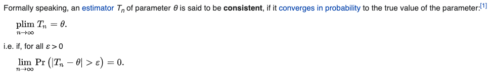
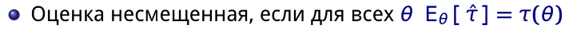

# Python

## 1. Data structures

### type annotation, type conversion (implicit and explicit)

Например ` def indent_right(s: str, width: int) -> str:.`

Например `price: int = 5`

- Implicit

Неявное преобразование типов автоматически выполняется интерпретатором Python.

Python позволяет избежать потери данных в неявном преобразовании типов.

```
integer_number = 123
float_number = 1.23
new_number = integer_number + float_number
```

- Explicit

Явное преобразование типов также называется приведением типов, типы данных объекта преобразуются с использованием предопределенной функции.

При приведении типов может произойти потеря данных, поскольку мы приводим объект к определенному типу данных.

int('3'), str(), float()

### 1.1 Strings

#### string interpolation

  name = 'Chris'
  print(f'Hello {name}')
  print('Hey %s %s' % (name, name))
  print(
  "My name is {}".format((name))
  )

### 1.2 Lists

#### copy and deepcopy()

copy - ref on  object,  all elements ref on copy

deepcopy - new object, and every element ref on copy, but when change, new element object

#### list and array

- array same data type
- array +, - linear operations, different methods append
- arrays less memory

## 1.5 Queue types in python

Queue data structure has three types: **FIFO, LIFO, and Priority Queue**

```
def heapsort(iterable):
    h = []
    for value in iterable:
        heappush(h, value)
    return [heappop(h) for i in range(len(h))]

heapsort([1, 3, 5, 7, 9, 2, 4, 6, 8, 0])
```

In fact, the `PriorityQueue` *implementation* uses `heapq` under the hood to do all prioritisation work, with the base `Queue` class providing the locking to make this thread-safe. See the [source code](https://hg.python.org/cpython/file/v2.7.11/Lib/Queue.py#l212) for details.

### 1.6 Operators

#### difference == and is

Identity (is) and equality (==), can check by id(var), same or note memory cell

## 2.Design patterns

### Decorators

Function of function and return function (logger, get time of execution)

Декоратор – это функция, которая получает функцию в качестве входных данных и возвращает её в качестве выходных данных, но расширяя её функционал без изменения основной модели.

У декоратора есть одна приятная особенность: вы можете написать код для одной функции, а далее использовать его по-необходимости с другими.

Типичный случай использования декораторов – это логирование.

def logging(func):
 def log_function_called():
   print(f'{func} called.')
   func()
 return log_function_called

### DVC - data version control

There  3 main entities:

- output (real files of projects) - data folder in example
- cache (hashes of files, flat structure for tracking data changes)
- remote (local external) storage (need access) - remote cache or(and) output

> CREATE dvc in repo
> +1. dvc with local storage of cache and outputs (example im_sales)
> you need do dvc folder "data
> 1.1 dvc init
> git status
> Changes to be committed:
> new file:   .dvc/.gitignore
> new file:   .dvc/config
> ...
> git commit -m "Initialize DVC"
> 1.2 dvc remote add {name} 'path/to/remote/**cache** storage (for cache) - can be local path ('C:\_Work\datasets or )
> 1.3 dvc add data (adds outputs to local cache (.dvc/cache)) -> data.dvc
> git add data/data.xml.dvc (add .)
> git commit -m "Add raw data"
> git push
> 1.4 dvc push - push to remote storage **cache**
> Make changes dvc add data & git commit & dvc push
> Switch between versions git checkout & dvc checkout
> 2. remote cache
> 1.1 dvc init
> git status
> Changes to be committed:
> new file:   .dvc/.gitignore
> new file:   .dvc/config
> ...
> git commit -m "Initialize DVC"
> 1.2 dvc remote add {name} 'path/to/remote/**cache** storage (for cache) - can be local path ('C:\_Work\datasets or )
> 1.3 dvc config cache.s3 {name}
> 1.4 dvc add **data** (local data) -> data.dvc then git commit & git push
> dvc add --external path/to/**data** (external data) -> data.dvc, then git commit&git push

USAGE and REPRODUCTION of repo for others (im_sales)

!All data and cache are added to .gitignore and are saved only **locally**. To use repo (im_sales) and get access to data create remote folder (_WORK) to wich others collaborators **have access (keys or tokens or local shared net)**.

When git clone repo, then dvc pull to get data from shared folder _WORK. (all info for pull is in data.dvc file)

## 3.OOP

### introspection in python

Интроспекция — это способность программы исследовать тип или свойства объекта во время работы программы

/ Java

if(obj instanceof Person){
   Person p = (Person)obj;
   p.walk();
}

В Python самой распространённой формой интроспекции является использование метода dir для вывода списка атрибутов объекта

isinstance(foo, object))

### reflection

Интроспекция позволяет вам изучать атрибуты объекта во время выполнения программы, а **рефлексия** — манипулировать ими.

**Рефлексия** — это способность компьютерной программы изучать и модифицировать свою структуру и поведение (значения, мета-данные, свойства и функции) во время выполнения.

 Простым языком: она позволяет вам *вызывать методы объектов, создавать новые объекты, модифицировать их, даже не зная имён интерфейсов, полей, методов во время компиляции.*

 Из-за такой природы **рефлексии** её труднее реализовать в статически типизированных языках, поскольку ошибки типизации возникают во время компиляции, а не исполнения программы (подробнее об этом здесь). Тем не менее, она возможна, ведь такие языки, как Java, C# и другие допускают использование как интроспекции, так и **рефлексии** (но не C++, он позволяет использовать лишь интроспекцию).

По той же причине **рефлексию** проще реализовать в интерпретируемых языках, поскольку когда функции, объекты и другие структуры данных создаются и вызываются во время работы программы, используется какая-то система распределения памяти. Интерпретируемые языки обычно предоставляют такую систему по умолчанию, а для компилируемых понадобится дополнительный компилятор и интерпретатор, который следит за **корректностью рефлексии.**

**Пример:**

`# Без рефлексии
Foo().hello()

с рефлексией

getattr(globals()[&#39;Foo&#39;](), 'hello')

### descriptor

**Дескриптор** - такой атрибут объекта, поведение которого переопределяется специальными методами. Проще говоря, доступ к какому-то свойству экземпляра можно переопределить с учетом дополнительных проверок. Если делать эти верификации без дескрипторов, то один и тот же код начнет повторяться.

Существует 4 метода протокола дескрипторов:
`get__()` - получить значение свойства;
`set__() `- задать значение;
`delete__() `- удалить атрибут;
`set_name__() `- присвоить имя свойству (появился в Питоне версии 3.6).

Если применяется только метод ` __get__(),` то мы имеем дело с дескриптором без данных, а если есть еще и `__set__()`, то речь будет идти о дескрипторе данных.

Покажем использование дескрипторов на вышеупомянутом примере.

**Example**

Создаем класс с протоколами дескриптора

`class StringChecker:`

```
class StringChecker:

    # # Получаем доступ к свойству
    def __get__(self, instance, owner):
        if instance is None:
            return self
        return instance.__dict__[self.name]

    # Меняем свойство
    def __set__(self, instance, str_value):
        if not isinstance(str_value, str):
            raise ValueError('Нужно предоставить строку')
        elif len(str_value) < 2:
            raise ValueError('Необходимо минимум 2 буквы')
        instance.__dict__[self.name] = str_value

    # Задаем имя свойства
    def __set_name__(self, owner, name):
        self.name = name
```

```
class Employee:

    # Определяем атрибуты (их может быть любое количество)
    name = StringChecker()

    # Инициализируем свойства с учетом требуемых проверок
    def __init__(self, name):
        self.name=name
```

Тесты

`director = Employee('Иван', 'Николаевич', 'Прогин', 'Директор') print(director.__dict__) `
`director.name = 1 `
`director.name = 'A'`

### exemple (self, ), class(cls, ) and static () methods

 **Методы экземпляра** : принимают параметр self и относятся к определенному экземпляру класса. selfin call

 **Статические методы** : используют декоратор @staticmethod, не связаны с конкретным экземпляром и являются автономными (атрибуты класса или экземпляра не изменяются). - dont change class or example

**Методы класса** : принимают параметр cls, можно изменить сам класс. call (cls, )

### func and func()

func - object, you can use it as attribute, as var, func()  - call of func

### Как изменить способ вывода объектов?

Используйте методы __str__ и __repr_
_str_ - readable
__repr__ - unumbigous
str(3) == str("3")

### перегрузка операторов

> под операторами в данном контексте понимаются не только знаки +, -, *, /, обеспечивающие операции сложения, вычитания и др., но также специфика синтаксиса языка, обеспечивающая операции создания объекта, вызова объекта как функции, обращение к элементу объекта по индексу, вывод объекта
>
> __call__, __getitem__

### ORM

object-relational mapping - To connect database with model data

SQLAlchemy in Flask, ORM in Django

## 4.Modules

### Модуль, пакет, библиотека

 – это просто файл Python, который предназначен для импорта в скрипты или в другие модули. Он содержит функции, классы и глобальные переменные.

Пакет – это набор модулей, которые сгруппированы вместе внутри папки для обеспечения согласованной функциональности. Пакеты могут быть импортированы точно так же, как модули. Обычно в них есть __init__.pyfile, который указывает интерпретатору Python обрабатывать их.

Библиотека – это набор пакетов.

package is catalog with modules, all packages are moduls, library is catalog with packages

### Как бы вы использовали * args и **kwargs?

*args и **kwargs – это конструкции, которые делают функции Python более гибкими, принимая изменчивое количество аргументов.

* *args передаёт изменчивое количеств
* во аргументов без ключевых слов в список
* **kwargs передаёт изменчивое количество аргументов с ключевыми словами в словарь

## 5. Exceptions

### example

try:
    # попробовать сделать это
except:
    # если блок try не сработал, попробовать это
finally:
    # всегда делать это

## 6. Multiprocessing and multithreading

### В чём заключается проблема с многопоточностью в python?

Глобальная блокировка интерпретатора (или GIL) не позволяет интерпретатору Python выполнять более одного потока одновременно. Проще говоря, GIL требует, чтобы в Python всегда выполнялся только один поток.

### В чём разница между многопроцессорностью и многопоточностью?

Многопроцессорность и многопоточность – это парадигмы программирования, направленные на ускорение вашего кода.

**Многопроцессорность** – это вариант реализации вычислений, когда для решения некоторой прикладной задачи используется несколько независимых процессоров. Процессоры независимы и не взаимодействуют друг с другом: они не используют одну и ту же область памяти и имеют строгую изоляцию между собой. Что касается приложений, то многопроцессорная обработка подходит для рабочих нагрузок с интенсивным использованием ЦП. Однако он имеет большой объем памяти, который пропорционален количеству процессоров.

С другой стороны, в **многопоточных** приложениях потоки находятся внутри одного процессора. Следовательно, они используют одну и ту же область памяти: они могут изменять одни и те же переменные и могут мешать друг другу. В то время как процессы строго выполняются параллельно, в Python в данный момент времени выполняется только один поток, и это связано с глобальной блокировкой интерпретатора (GIL). Многопоточность подходит для приложений, связанных с вводом-выводом, таких как очистка веб-страниц или извлечение данных из базы данных.

Если вы хотите узнать больше о многопоточности и многопроцессорности, я рекомендую вам ознакомиться с [этой статьей](https://medium.com/contentsquare-engineering-blog/multithreading-vs-multiprocessing-in-python-ece023ad55a).

### Multithreading code

```
import time
from concurrent.futures import ProcessPoolExecutor, ThreadPoolExecutor

import matplotlib.pyplot as plt
import numpy as np


def multithreading(func, args, workers):
    with ThreadPoolExecutor(workers) as ex:
        res = ex.map(func, args)
    return list(res)


def multiprocessing(func, args, workers):
    with ProcessPoolExecutor(workers) as ex:
        res = ex.map(func, args)
    return list(res)


def cpu_heavy(x):
    print('I am', x)
    start = time.time()
    count = 0
    for i in range(10**8):
        count += i
    stop = time.time()
    return start, stop


def visualize_runtimes(results, title):
    start, stop = np.array(results).T
    plt.barh(range(len(start)), stop - start)
    plt.grid(axis='x')
    plt.ylabel("Tasks")
    plt.xlabel("Seconds")
    plt.xlim(0, 22.5)
    ytks = range(len(results))
    plt.yticks(ytks, ['job {}'.format(exp) for exp in ytks])
    plt.title(title)
    return stop[-1] - start[0]


plt.subplot(1, 2, 1)
visualize_runtimes(multithreading(cpu_heavy, range(4), 4), "Multithreading")
plt.subplot(1, 2, 2)
visualize_runtimes(multiprocessing(cpu_heavy, range(4), 4), "Multiprocessing")
plt.show()
```

**multithreading**

```
wiki_page_urls = ["https://en.wikipedia.org/wiki/" + str(i) for i in range(50)]
with concurrent.futures.ThreadPoolExecutor() as executor:
    futures = []
    for url in wiki_page_urls:
        futures.append(executor.submit(get_wiki_page_existence, wiki_page_url=url))
        # # many parameters
        # futures.append(executor.submit(lambda p: get_columns_batch(*p),
        #                         [docs_left_all, docs_right_all, docs_pages_all, batch, model, ith]))
    for future in concurrent.futures.as_completed(futures):
        print(future.result())
```

### asyncio code (python 3.9)

We say that an object is an **awaitable** object if it can be used in an [`<span class="pre">await</span>`](https://docs.python.org/3.9/reference/expressions.html#await) expression. Many asyncio APIs are designed to accept awaitables.

There are three main types of *awaitable* objects:  **coroutines** ,  **Tasks** , and  **Futures** .

Important

 In this documentation the term “coroutine” can be used for two closely related concepts:

* a  *coroutine function* : an **async def** function;
* a  *coroutine object* : an object returned by calling a  *coroutine function* .

Tasks are used to schedule coroutines concurrently.
A Future is a special low-level awaitable object that represents an eventual result of an asynchronous operation

```
import asyncio
import concurrent.futures

def blocking_io():
    # File operations (such as logging) can block the
    # event loop: run them in a thread pool.
    with open('/dev/urandom', 'rb') as f:
        return f.read(100)

def cpu_bound():
    # CPU-bound operations will block the event loop:
    # in general it is preferable to run them in a
    # process pool.
    return sum(i * i for i in range(10 ** 7))

async def main():
    loop = asyncio.get_running_loop()

    ## Options:

    # 1. Run in the default loop's executor:
    result = await loop.run_in_executor(
        None, blocking_io)
    print('default thread pool', result)

    # 2. Run in a custom thread pool:
    with concurrent.futures.ThreadPoolExecutor() as pool:
        result = await loop.run_in_executor(
            pool, blocking_io)
        print('custom thread pool', result)

    # 3. Run in a custom process pool:
    with concurrent.futures.ProcessPoolExecutor() as pool:
        result = await loop.run_in_executor(
            pool, cpu_bound)
        print('custom process pool', result)

asyncio.run(main())
```

 **Сопрограмма (coroutine) ** — результат вызова асинхронной функции, представляющий собой выполнение этой функции, способное приостанавливаться. Так как в общем случае невозможно определить сколько раз и на какое время выполнение будет приостановлено, невозможно и сказать когда оно будет закончено. Ваш код может либо ждать завершения выполнения сопрограммы с помощью оператора await, либо поручить ожидание циклу событий и продолжить свой выполнение.

**В первом случае**

```
async def callee():
    print('Hello')

async def caller():
    await callee()
    print('World')
```

выполнение caller приостановится до выполнения callee. В этот момент какие-то другие операции в каких-то других сопрограммах могут продолжаться, но `caller` будет ждать там, где выполнил `await`.

Во втором случае

```
async def callee():
    print('Hello')

async def caller():
    asyncio.create_task(callee())
    print('World')
```

**caller** сразу же продолжит свою работу. Строка `"World"` будет выведена раньше, чем "`Hello".` Здесь мы видим, что caller поставил циклу событий задачу выполнить сопрограмму callee.

Но что если, callee будет возвращать какое-то значение, которое нужно вызывающей стороне, но не прямо сейчас, а когда будет готово? Вот тут-то на сцену выходят футуры.

 **Футура (Future) ** - будущий результат выполнения сопрограммы. Метод `ensure_future` поручает циклу событий выполнить сопрограмму и сразу же, в момент вызова, возвращает футуру, в которой будет значение, но неизвестно когда. Вызывающая сторона может подождать выполнения футуры так же, как ожидало саму сопрограмму

**wait future**

```python
async def callee(fut, word):
    fut.set_result(word)

async def caller():
    loop = asyncio.get_running_loop()
    # Create a new Future object.
    fut = loop.create_future()
    # Run "set_after()" coroutine in a parallel Task.
    # We are using the low-level "loop.create_task()" API here because
    # we already have a reference to the event loop at hand.
    # Otherwise we could have just used "asyncio.create_task()".
    loop.create_task(callee(fut, '... world'))
    # Wait until *fut* has a result (1 second) and print it.
    print(await fut + ' Hello')

await caller() # for jupyter notebook, becouse loop is already running in jupyter
# asyncio.run(main()) # for py file
```

**do something while future is not done**

```python
async def callee(fut, word):
    await asyncio.sleep(4)
    fut.set_result(word)

async def caller():
    loop = asyncio.get_running_loop()
    # Create a new Future object.
    fut = loop.create_future()
    loop.create_task(callee(fut, '... world'))
    while not fut.done():
        await asyncio.sleep(1)
        print('do something when fut is running')

    print(await fut + ' World')

await caller() # for jupyter notebook, becouse loop is already running in jupyter
```

**callback**

```python
import functools
async def callee(fut, word):
    await asyncio.sleep(4)
    fut.set_result(word)

async def caller():
    loop = asyncio.get_running_loop()
    # Create a new Future object.
    fut = loop.create_future()
    loop.create_task(callee(fut, '... world'))
    fut.add_done_callback(functools.partial(print, "Future:"))
    print('test')
```

**asyncio concurrent**

```python
async def main():
    await function_that_returns_a_future_object() # task

    # this is also valid:
    await asyncio.gather(
        function_that_returns_a_future_object(),
        some_python_coroutine()
    )

all_the_coros = asyncio.gather(
*[self._worker(i) for i in range(self.max_workers)])
async def _worker(self, i):
    return
```

## 7. Input output 

### Как прочитать файл объемом 8 ГБ на Python с помощью компьютера с 2 ГБ ОЗУ

with open("./large_dataset.txt") as input_file:
    for line in input_file:
        process_line(line)

# Statistic and probability

### exp distribution vs poisson

https://www.youtube.com/watch?v=n7K8s4vryCQ&ab_channel=ExplainedbyMichael

exp and pois distribution are from poisson process:

1) memoryless, all events are independent
2) average time between events is known and constant
3) events cannot occure simultelesnly ( tine interval between events as Bernully trial (event happen or not))

Poisson dist can be used as approx of binomial distribution, if n is sufficiently large and p is sufficiently small

Pois(k, lambda = n * p) = B( k, n, p)

Exp:       										Poisson:

1. how much time between given number of		1. How many events in given time interval (fixed time)

events ( fixed events)

2. Random var - time							2. number of enents - descrete
3. lambda - rate of occurance(customers per hour,	3. lambda - expected number of occurences ( number of customers every period, unitless)
   measure - time ^(-1), frequency, time)			4. can approx bernully when large n, and small p
4. special case of gamma (shape=1,  scale = 1/lambda)
5. continuous of geometric ( time until event occurs)

### probability vs likelihood

˚probability = given distribution find probability of events

pr(x1, x2, x3, x4| distr)

likelihood - given data find likelihood of distribution (statistics)

L(distr|x1, x2, x3, x4)

**probability is the quantity most people are familiar with which deals with predicting new data given a known model ("what is the probability of getting heads six times in a row flipping this **[50:50](https://www.youtube.com/watch?v=pYxNSUDSFH4&t=3050s) coin?") while likelihood deals with fitting models given some known data ("what is the likelihood that this coin is/isn't rigged given that I just flipped heads six times in a row?"). I wanted to add this perspective because using the example in this clip, a likelihood quantity such as 0.12 is not meaningful to the layman unless it is explained exactly what 0.12 means: a measure of the sample's support for the assumed model i.e. low values either mean rare data or incorrect model!

### Map, MLE and MOP

[https://en.wikipedia.org/wiki/Maximum_a_posteriori_estimation]()

It is closely related to the method of [maximum likelihood](https://en.wikipedia.org/wiki/Maximum_likelihood "Maximum likelihood") (ML) estimation, but employs an augmented [optimization objective](https://en.wikipedia.org/wiki/Optimization_(mathematics)) "Optimization (mathematics)") which incorporates a [prior distribution](https://en.wikipedia.org/wiki/Prior_distribution "Prior distribution") (that quantifies the additional information available through prior knowledge of a related event) over the quantity one wants to estimate. MAP estimation can therefore be seen as a [regularization](https://en.wikipedia.org/wiki/Regularization_(mathematics)) "Regularization (mathematics)") of maximum likelihood estimation.

The case of {\displaystyle \sigma _{m}\to \infty } is called a non-informative prior and leads to an ill-defined a priori probability distribution; in this case {\displaystyle {\hat {\mu }}_{\mathrm {MAP} }\to {\hat {\mu }}_{\mathrm {MLE} }.}

MLE - maximum likelihood

MOP = method of momentums

### What is maximum likelihood estimation? Could there be any case where it doesn’t exist?

A method for parameter optimization (fitting a model). We choose parameters so as to maximize the likelihood function (how likely the outcome would happen given the current data and our model).
maximum likelihood estimation (MLE) is a method of estimating the parameters of a statistical model given observations, by finding the parameter values that maximize the likelihood of making the observations given the parameters. MLE can be seen as a special case of the maximum a posteriori estimation (MAP) that assumes a uniform prior distribution of the parameters, or as a variant of the MAP that ignores the prior and which therefore is unregularized.
for gaussian mixtures, non parametric models, it doesn’t exist

### A/B testing

#### In an A/B test, how can you check if assignment to the various buckets was truly random?

* Plot the distributions of multiple features for both A and B and make sure that they have the same shape. More rigorously, we can conduct a permutation test to see if the distributions are the same.
* MANOVA to compare different means

#### What might be the benefits of running an A/A test, where you have two buckets who are exposed to the exact same product?

* Verify the sampling algorithm is random.

#### What would be the hazards of letting users sneak a peek at the other bucket in an A/B test?

The user might not act the same suppose had they not seen the other bucket. You are essentially adding additional variables of whether the user peeked the other bucket, which are not random across groups.

#### How would you run an A/B test for many variants, say 20 or more?

one control, 20 treatment, if the sample size for each group is big enough.
Ways to attempt to correct for this include changing your confidence level (e.g. Bonferroni Correction) or doing family-wide tests before you dive in to the individual metrics (e.g. Fisher's Protected LSD).

#### How would you run an A/B test if the observations are extremely right-skewed?

lower the variability by modifying the KPI
cap values
percentile metrics
log transform

#### How would you design an experiment to determine the impact of latency on user engagement?

The best way I know to quantify the impact of performance is to isolate just that factor using a slowdown experiment, i.e., add a delay in an A/B test.

### Hypotesis testing

#### What is a p-value? What is the difference between type-1 and type-2 error?

A p-value is defined such that under the null hypothesis less than the fraction p of events have parameter values more extreme than the observed parameter. It is not the probability that the null hypothesis is wrong.
type-1 error: rejecting Ho when Ho is true
type-2 error: not rejecting Ho when Ha is true

## Bootstrapping

 is any test or metric that uses [random sampling with replacement](https://en.wikipedia.org/wiki/Sampling_(statistics)#Replacement_of_selected_units "Sampling (statistics)") (e.g. mimicking the sampling process), and falls under the broader class of [resampling](https://en.wikipedia.org/wiki/Resampling_(statistics)) "Resampling (statistics)") methods. Bootstrapping assigns measures of accuracy (bias, variance, [confidence intervals](https://en.wikipedia.org/wiki/Confidence_interval "Confidence interval"), prediction error, etc.) to sample estimates. ^[[1]](https://en.wikipedia.org/wiki/Bootstrapping_(statistics)#cite_note-:0-1)^ ^[[2]](https://en.wikipedia.org/wiki/Bootstrapping_(statistics)#cite_note-2)^ This technique allows estimation of the sampling distribution of almost any statistic using random sampling methods

It may also be used for constructing [hypothesis tests](https://en.wikipedia.org/wiki/Statistical_hypothesis_testing "Statistical hypothesis testing"). It is often used as an alternative to [statistical inference](https://en.wikipedia.org/wiki/Statistical_inference "Statistical inference") based on the assumption of a parametric model when that assumption is in doubt, or where parametric inference is impossible or requires complicated formulas for the calculation of [standard errors](https://en.wikipedia.org/wiki/Standard_error "Standard error").

## Statistical inference

 is the process of using data analysis to infer properties of an underlying distribution of probability.[1] Inferential statistical analysis infers properties of a population, for example by **testing hypotheses and deriving estimates**   It is assumed that the observed data set is sampled from a larger population.

Inferential statistics can be contrasted with **descriptive** statistics. Descriptive statistics is solely concerned with properties of the observed data, and it does not rest on the assumption that the data come from a larger population. In machine learning, the term inference is sometimes used instead to mean "make a prediction, by evaluating an already trained model";[2] in this context inferring properties of the model is referred to as training or learning (rather than inference), and using a model for prediction is referred to as inference (instead of prediction); see also predictive inference ( gone to obsolete because new approach - data for analysis has **error**)

## Sample and Population estimator, consistent and unbiased

Sample  - статистическая оценка, population - оцениваямая величина

Смещенная и состоятельная оценка



In [statistics](https://en.wikipedia.org/wiki/Statistics "Statistics"), the **bias of an estimator** (or  **bias function** ) is the difference between this [estimator](https://en.wikipedia.org/wiki/Estimator "Estimator")'s [expected value](https://en.wikipedia.org/wiki/Expected_value "Expected value") and the [true value](https://en.wikipedia.org/wiki/True_value "True value") of the parameter being estimated. An estimator or decision rule with zero bias is called  ***unbiased*** . In statistics, "bias" is an *objective* property of an estimator. Bias is a distinct concept from [consistency](https://en.wikipedia.org/wiki/Consistent_estimator "Consistent estimator"): consistent estimators converge in probability to the true value of the parameter, but may be biased or unbiased; see [bias versus consistency](https://en.wikipedia.org/wiki/Consistent_estimator#Bias_versus_consistency "Consistent estimator") for more.ML




An estimator is said to be **unbiased** if its bias is equal to zero for all values of parameter  *θ* , or equivalently, if the expected value of the estimator matches that of the parameter

## What is unbiasedness as a property of an estimator? Is this always a desirable property when performing inference? What about in data analysis or predictive modeling?

Unbiasedness means that the expectation of the estimator is equal to the population value we are estimating. This is desirable in inference because the goal is to explain the dataset as accurately as possible. However, this is not always desirable for data analysis or predictive modeling as there is the bias variance tradeoff. We sometimes want to prioritize the generalizability and avoid overfitting by reducing variance and thus increasing bias.

# ML

How to make normal distribution:

- log transform
- square root
- reciprocal
- box -cox transform (all three previous in one)

## Metrics

## нечеткое сравнение строк

1) Алгоритм Левенштейна уже посложней, в его основе расчет количества операций, необходимых для преобразования одной строки в другую. Существует 3 таких операции:

* вставка символа (сыто → сыт**н**о);
* удаление символа (гидра**н**т → гидрат);
* замена одного символа на другой (**у**своить → **о**своить).

2) В алгоритме Дамерау-Левенштейна добавляется дополнительная операция транспозиции
3) Расстояние Джаро-Винклера основывается на поиске точных и неточных совпадений в анализируемых строках. Под точным совпадением подразумевается совпадение значения и порядкового номера символа, под неточным — совпадение значения и порядкового номера символа ± длина совпадений L.

## What is the curse of dimensionality?

* High dimensionality makes clustering hard, because having lots of dimensions means that everything is "far away" from each other.
* For example, to cover a fraction of the volume of the data we need to capture a very wide range for each variable as the number of variables increases
* All samples are close to the edge of the sample. And this is a bad news because prediction is much more difficult near the edges of the training sample.
* The sampling density decreases exponentially as p increases and hence the data becomes much more sparse without significantly more data.
* We should conduct PCA to reduce dimensionality
* 

## regularization

is a process that changes the result answer to be "simpler". It is often used to obtain results for ill-posed problems or to prevent overfitting.[2]

Although regularization procedures can be divided in many ways, following delineation is particularly helpful:

Explicit regularization is regularization whenever one explicitly adds a term to the optimization problem. These terms could be priors, penalties, or constraints. Explicit regularization is commonly employed with ill-posed optimization problems. The regularization term, or penalty, imposes a cost on the optimization function to make the optimal solution unique.
Implicit regularization is all other forms of regularization. This includes, for example, early stopping, using a robust loss function, and discarding outliers. Implicit regularization is essentially ubiquitous in modern machine learning approaches, including stochastic gradient descent for training deep neural networks, and ensemble methods (such as random forests and gradient boosted trees).

## Linear regression

### regression

regression means regress (step back ) to the best fit line (co-relation line)

y = f(x) + error (normal distribution with 0 mean)

### our linear regression didn’t run and communicates that there are an infinite number of best estimates for the regression coefficients. What could be wrong?

* p > n.
* If some of the explanatory variables are perfectly correlated (positively or negatively) then the coefficients would not be unique.

## Multicollinearity, correlation, covariance

regressor - dependent variable

*Correlation is a statistical measure that indicates the extent to which two or more variables move together*

*Covariance is another measure that describes the degree to which two variables tend to deviate from their means in similar ways*

*Collinearity is a linear association between two predictors - when correlation > 0.7*

collinearity can be detected :

- Prominent changes in the estimated regression coefficients by adding or deleting a predictor
- correlation matrix
- VIF
- PCA, PCR

**principal component regression** ( **PCR** ) is a [regression analysis](https://en.wikipedia.org/wiki/Regression_analysis "Regression analysis") technique that is based on [principal component analysis](https://en.wikipedia.org/wiki/Principal_component_analysis "Principal component analysis") (PCA). More specifically, PCR is used for [estimating](https://en.wikipedia.org/wiki/Estimation "Estimation") the unknown [regression coefficients](https://en.wikipedia.org/wiki/Linear_regression "Linear regression") in a [standard linear regression model](https://en.wikipedia.org/wiki/Linear_regression "Linear regression").

In PCR, instead of regressing the dependent variable on the explanatory variables directly, the [principal components](https://en.wikipedia.org/wiki/Principal_component_analysis "Principal component analysis") of the explanatory variables are used as [regressors](https://en.wikipedia.org/wiki/Dependent_and_independent_variables "Dependent and independent variables"). One typically uses only a subset of all the principal components for regression, making PCR a kind of [regularized](https://en.wikipedia.org/wiki/Regularization_(mathematics)) "Regularization (mathematics)") procedure and also a type of [shrinkage estimator](https://en.wikipedia.org/wiki/Shrinkage_estimator "Shrinkage estimator").

You have several variables that are positively correlated with your response, and you think combining all of the variables could give you a good prediction of your response. However, you see that in the multiple linear regression, one of the weights on the predictors is negative. What could be the issue?

* Multicollinearity refers to a situation in which two or more explanatory variables in a [multiple regression](https://en.wikipedia.org/wiki/Multiple_regression "Multiple regression") model are highly linearly related.
* Leave the model as is, despite multicollinearity. The presence of multicollinearity doesn't affect the efficiency of extrapolating the fitted model to new data provided that the predictor variables follow the same pattern of multicollinearity in the new data as in the data on which the regression model is based.
* principal component regression

# System Design
